# 逐篇证据卡

核对日期：2026-10-02。图页码为所列 PDF 的一基页序号，不一定等于出版物印刷页码。

SFT 和 RL 数据表示本文新增训练阶段；不列基座模型预训练数据。任务标签可能包含仅评测任务。

## Think with Structured Grounding: Perceptual Reinforcement Learning for Chart and Visual-Tabular Understanding

**首次公开：** 2026-08-23 · **发表/版本：** arXiv · **类别：** multimodal · **任务：** TQA / TFV

[论文](https://arxiv.org/abs/2608.22429) · [核对 PDF](https://arxiv.org/pdf/2608.22429v1) · 代码链接：未核实

**RL 方法：** Cold-start SFT + TL-GRPO

先蒸馏区域定位、局部观察与交错推理轨迹，再用 TL-GRPO 按 think/observation/answer 标签分别归一化重要性权重；奖励结合答案 ANLS、格式与视觉观察核验，CGS 去除组内优势离群样本。

| 阶段 | 数据与用途 |
| --- | --- |
| SFT / 冷启动 | TwSG-12K：12,674 条；Appendix E 将来源写作 TableQA、TableQA-X、Visual-TableQA，含合成多图表/多表格布局。 |
| RL 训练 | 64,334 条：原 SFT 数据及 ChartQA、ChartQA-X、Visual-TableQA 训练集，用 SFT checkpoint 四次采样后去除全对样本。 |
| 评测 | TableVQA-Bench（VWTQ、VWTQ-Syn、VTabFact、FinTabNetQA）；ChartQA、ChartQAPro、CharXiv-R。 |

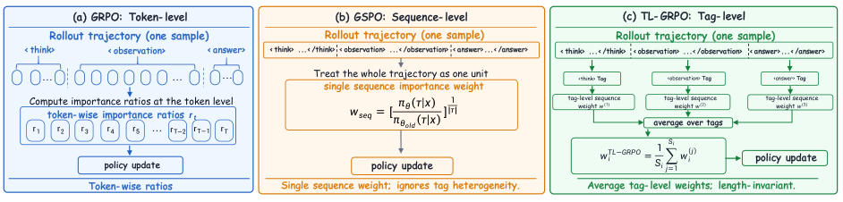

*原文 Fig. 2，PDF 第 4 页。Comparison of token, sequence and functional-tag importance sampling.*

**原文证据：**

- [Submission history](https://arxiv.org/abs/2608.22429)：First submitted 23 August 2026.
- [Sections 3.1–3.2; Appendix E](https://arxiv.org/html/2608.22429v1#S3)：SFT 12,674; RFT 64,334; tag-level optimization and visual verification rewards.
- [Figure 2, PDF page 4; Table 1, page 7](https://arxiv.org/pdf/2608.22429v1)：Original RL method schematic and explicit visual-table benchmark evaluation.

**阅读备注：**

- 同时覆盖 chart 与 visual table；因明确在 TableVQA-Bench 上实验而纳入。
- SFT 附录写 TableQA/TableQA-X，RFT 正文写 ChartQA/ChartQA-X，来源名称存在不一致，未自行改写。
- 未发现经作者确认的官方代码链接。

## When LLMs Read Tables Carelessly: Measuring and Reducing Data Referencing Errors

**首次公开：** 2026-06-30 · **发表/版本：** ACL 2026 Main · **类别：** text · **任务：** TQA / TFV

[论文](https://aclanthology.org/2026.acl-long.762/) · [核对 PDF](https://aclanthology.org/2026.acl-long.762.pdf) · [代码](https://github.com/ayyyq/table-referencing)

**RL 方法：** SFT + RLVR / GRPO

训练 Critic-4B 检测推理片段中的单元格误引与遗漏。先蒸馏 Sonnet-3.7 判断做 SFT，再以经核验的 True/False 标签为奖励做 GRPO；推理时用 critic 过滤候选或局部拒绝采样，从而减少错误数据引用。

| 阶段 | 数据与用途 |
| --- | --- |
| SFT / 冷启动 | WTQ 训练集上 Qwen3-8B 生成的响应片段；Sonnet-3.7 标注的 2,000 条正负平衡样本，SFT 2 epochs。 |
| RL 训练 | 同一 WTQ 响应片段来源的 5,712 条，GRPO 20 epochs、每题 8 rollouts。另有规则插入四类 DRE 的 synthetic critic 对照。 |
| 评测 | 训练后 critic：WTQ、TableBench（Fact Checking + Numerical Reasoning）、FinQA × 三个生成模型，共 3,600 条正负平衡片段；并在这三个基准检验拒绝采样。SciTab/ToTTo 仅用于前面的通用模型错误分析。 |

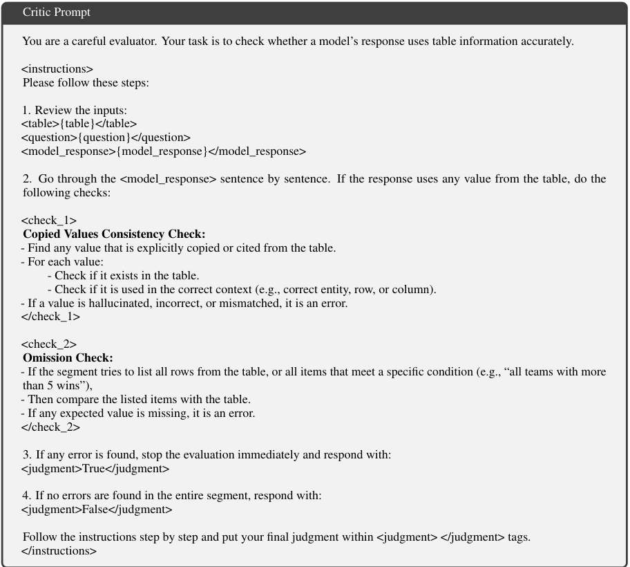

*原文 Fig. 6，PDF 第 17 页。Critic Prompt for small-scale LLMs (method specification, not an RL architecture diagram).*

**原文证据：**

- [Submission history](https://arxiv.org/abs/2606.32029)：First submitted 30 June 2026.
- [Bibliographic metadata](https://aclanthology.org/2026.acl-long.762/)：ACL 2026 main long paper, July 2026.
- [Section 5.1 PDF page 7; Appendix D page 13](https://aclanthology.org/2026.acl-long.762.pdf)：Actual critic SFT warm-up + GRPO, with 2,000 SFT and 5,712 RL segments; 20 epochs and G=8.
- [Sections 5.2–5.3 pages 7–8; Figure 6 page 17](https://aclanthology.org/2026.acl-long.762.pdf)：Critic evaluation 3,600 samples on WTQ/TableBench/FinQA; original method prompt figure, no dedicated RL architecture figure.
- [Training Critic-4B; Supported Datasets](https://github.com/ayyyq/table-referencing)：Author code confirms binary-label GRPO, data files and actual TableBench FactChecking/NumericalReasoning tasks.

**阅读备注：**

- RL 更新的是错误引用 critic，生成答案的模型通过推理时过滤/拒绝采样改善，未在本文用 RL 重训。
- SciTab/ToTTo 出现在错误分析中，不能据此声称训练后的 Critic-4B 做了 T2T 实验。
- 论文没有单独的 RL 方法架构图，所提取 Fig.6 是 critic 输入和判断流程的提示图。
- 论文与主数据版本日期按 arXiv/ACL 核实；作者仓库引用条目的 year=2025 与正式 metadata 不一致，未采用。

## What are Key Factors for Updates in RL for LLM Reasoning?

**首次公开：** 2026-06-21 · **发表/版本：** arXiv · **类别：** text · **任务：** TQA

[论文](https://arxiv.org/abs/2606.22570) · [核对 PDF](https://arxiv.org/pdf/2606.22570v2) · [代码](https://github.com/Control-derek/ACPO)

**旧标题/别名：** ACPO

**日期说明：** 采用可核实的 arXiv 首次提交 2026-06-21；存在更早同标题匿名 OpenReview 版本，但其首次公开日期本次未核实，未断言会议录用。

**核对版本：** arXiv v2，2026-09-19

**RL 方法：** Adaptive Clip Policy Optimization（ACPO）

分析 rollout 后更新次数导致的重要性采样与梯度偏移；按行为 token 概率分组，以各组重要性比率的经验方差动态设置裁剪边界。使用 GRPO 类相对优势，分别训练表格 QA、数学与逻辑推理模型。

| 阶段 | 数据与用途 |
| --- | --- |
| SFT / 冷启动 | 未新增 SFT；从 Qwen 系列模型进行 RL。 |
| RL 训练 | 表格 QA 实验单独在 HiTab 上训练；其他实验分别使用 ORZ 57K 数学数据与 Countdown。未报告 HiTab 最终训练子集数量。 |
| 评测 | HiTab；数学和 Countdown 对照。Table 1(b) 为 HiTab 训练后的最佳验证奖励，正文与表注对验证/测试口径有差异。 |

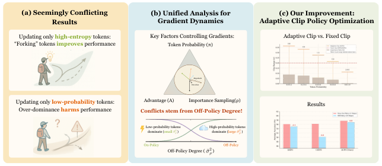

*原文 Fig. 1，PDF 第 2 页。原文理论分析、梯度因素与 ACPO 方法概览。*

**原文证据：**

- [§4，PDF pp.6–7](https://arxiv.org/pdf/2606.22570v2)：按概率分箱、估计重要性比率方差并自适应裁剪。
- [§5.1 / Table 1(b)，PDF p.8](https://arxiv.org/pdf/2606.22570v2)：明确独立的 HiTab 训练；不是只在通用 RL 模型上测试表格。
- [Fig.1，PDF p.2](https://arxiv.org/pdf/2606.22570v2)：原文分析与 ACPO 方法概览。
- [论文元数据 / 版本记录](https://arxiv.org/abs/2606.22570)：标题、日期与公开版本来源；采用下述日期说明（如有）。

**阅读备注：**

- Table 1 注释报告 best validation reward；正文称 avg@4 test accuracy，解读时应保留该口径差异。

## TableMix: Enhancing Multimodal Table Reasoning in MLLMs from a Data-Centric Perspective

**首次公开：** 2026-06 · **发表/版本：** CVPR 2026 · **类别：** multimodal · **任务：** TQA / TFV

[论文](https://openaccess.thecvf.com/content/CVPR2026/html/Liu_TableMix_Enhancing_Multimodal_Table_Reasoning_in_MLLMs_from_a_Data-Centric_CVPR_2026_paper.html) · [核对 PDF](https://openaccess.thecvf.com/content/CVPR2026/papers/Liu_TableMix_Enhancing_Multimodal_Table_Reasoning_in_MLLMs_from_a_Data-Centric_CVPR_2026_paper.pdf) · 代码链接：未核实

**RL 方法：** GRPO + Difficulty-Aware Reward Shaping (DRS)

按 batch 混合视觉表格推理、纯文本数学与简单表格感知数据，用 GRPO 同时恢复逻辑推理并保持视觉定位；DRS 根据组内成功率和退火长度惩罚，让简单问题的正确回答更简洁。

| 阶段 | 数据与用途 |
| --- | --- |
| SFT / 冷启动 | 主训练流程未报告单独 SFT 阶段；基座为 Qwen2.5-VL-7B。 |
| RL 训练 | 表格来源：TabMWP、WTQ、HiTab、TAT-QA、FeTaQA、ToTTo、TabFact、FEVEROUS、HybridQA、FinQA、MultiModalQA、InfoTabs；数学默认 MetaMath；另规则生成单元格定位 QA。混合比例 0.7:0.2:0.1。 |
| 评测 | TabMWP、WTQ、HiTab、TAT-QA、FeTaQA、TabFact、InfoTabs；held-out TableVQA-Bench。 |

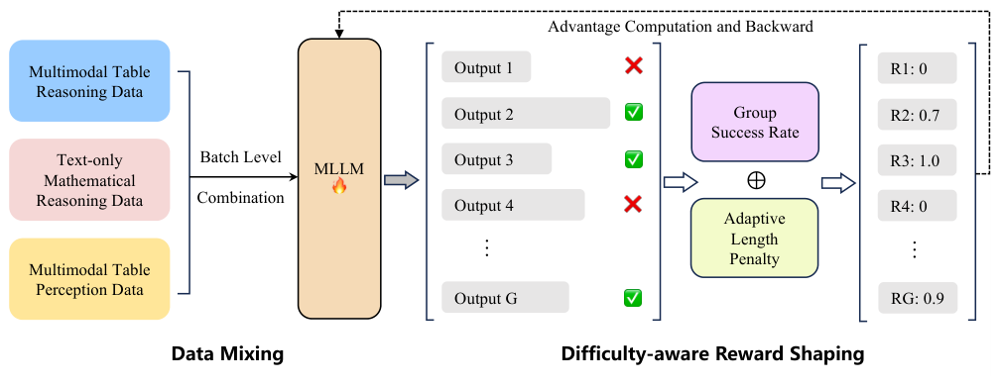

*原文 Fig. 2，PDF 第 4 页。Mixed training batches and difficulty-dependent GRPO reward shaping.*

**原文证据：**

- [Sections 3.2–3.4, PDF pages 4–6](https://openaccess.thecvf.com/content/CVPR2026/papers/Liu_TableMix_Enhancing_Multimodal_Table_Reasoning_in_MLLMs_from_a_Data-Centric_CVPR_2026_paper.pdf)：Actual GRPO with DRS; source corpus construction and default MetaMath data.
- [Section 4.1, page 6; Figure 2, page 4](https://openaccess.thecvf.com/content/CVPR2026/papers/Liu_TableMix_Enhancing_Multimodal_Table_Reasoning_in_MLLMs_from_a_Data-Centric_CVPR_2026_paper.pdf)：Mixing ratios 0.7/0.2/0.1, evaluation datasets and original framework figure.

**阅读备注：**

- 公开来源仅核实到 CVPR 2026 的 6 月会议版本；日期精度为月。
- ToTTo 是训练语料来源，不应据此声称评估了 T2T。
- GSM8K、Geo3K、DeepScaleR 是数学数据消融，不是默认数学训练集。
- 未发现经作者确认的官方代码链接。

## RSAT: Structured Attribution Makes Small Language Models Faithful Table Reasoners

**首次公开：** 2026-04-30 · **发表/版本：** ACL 2026 SURGeLLM Workshop (accepted; arXiv v2) · **类别：** text · **任务：** TQA / TFV

[论文](https://arxiv.org/abs/2605.00199) · [核对 PDF](https://arxiv.org/pdf/2605.00199v2) · [代码](https://github.com/JugalGajjar/RSAT)

**RL 方法：** SFT + GRPO

先用带单元格坐标引用的 JSON 推理轨迹做 SFT，再用 GRPO 优化答案 F1、引用坐标有效性、DeBERTa NLI 证据蕴含分数和引用简约性，并对无效 JSON 惩罚；使小模型的每步推理可追溯到表格单元格。

| 阶段 | 数据与用途 |
| --- | --- |
| SFT / 冷启动 | WikiTableQuestions、FeTaQA、TabFact；Claude Opus 4.5 生成 1,000 条轨迹，训练 900 条（630/135/135），验证 100 条。 |
| RL 训练 | 相同三个数据集的 table-question-answer 池；候选训练池 38,647 条，但每个模型实际抽取 500 条进行 GRPO。 |
| 评测 | WTQ/FeTaQA/TabFact 的混合 held-out test 池；实际评估 500 条。 |

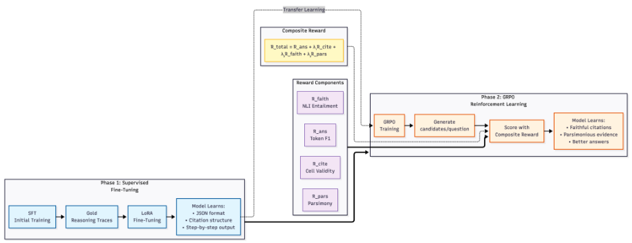

*原文 Fig. 1，PDF 第 3 页。RSAT overview: verified-trace SFT followed by composite-reward GRPO.*

**原文证据：**

- [Submission history and comments](https://arxiv.org/abs/2605.00199)：First submitted 30 April 2026; v2 7 May; accepted SURGeLLM ACL 2026.
- [Sections 3.2–3.5, Table 1](https://arxiv.org/html/2605.00199v2#S3)：Actual GRPO optimization, composite reward, source datasets and actual 500-example subsampling.
- [Figure 1, PDF page 3](https://arxiv.org/pdf/2605.00199v2)：Original method overview diagram.

**阅读备注：**

- FeTaQA 属于自由形式 TQA，不能标作传统无问题输入的 T2T。
- 忠实度奖励和主要评估指标使用同一个 NLI 模型；论文承认仍需人工评估验证。
- 训练数据池大小不能当作实际 GRPO 样本数。

## V-tableR1: Process-Supervised Multimodal Table Reasoning with Critic-Guided Policy Optimization

**首次公开：** 2026-04-22 · **发表/版本：** arXiv · **类别：** multimodal · **任务：** TQA / TFV

[论文](https://arxiv.org/abs/2604.20755) · [核对 PDF](https://arxiv.org/pdf/2604.20755v1) · 代码链接：未核实

**RL 方法：** SFT + Process-Guided Direct Alignment Policy Optimization (PGPO)

策略 VLM 生成含单元格坐标的视觉 CoT，独立 critic VLM 核验中间步骤；过程分数门控答案和格式奖励，配合解耦 clipping 与长度感知采样，惩罚幻觉和猜中答案的错误推理。

| 阶段 | 数据与用途 |
| --- | --- |
| SFT / 冷启动 | TabFact 5,250；FinQA 2,569；HiTab 3,195；TabMWP 4,412；WTQ 5,738，共 21,164 条视觉 CoT。critic 用真实/核验轨迹与 Qwen3-8B 扰动的负例。 |
| RL 训练 | TabFact 3,648；FinQA 583；HiTab 1,546；TabMWP 3,791；WTQ 5,887，共 15,455 条。 |
| 评测 | TabFact、FinQA、HiTab、TabMWP、WTQ；InfoTabs 与 TAT-QA 仅测试。 |

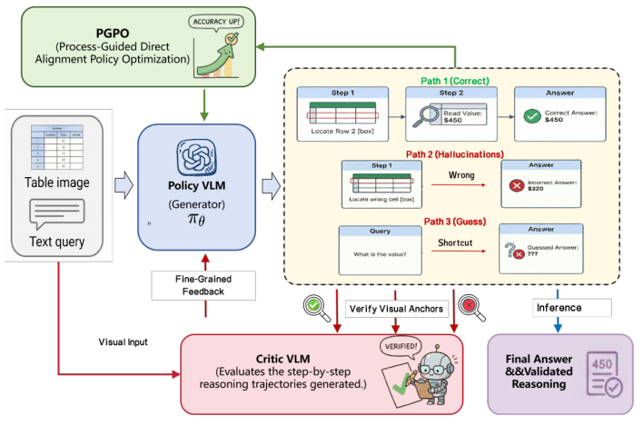

*原文 Fig. 2，PDF 第 6 页。Policy visual reasoning, critic verification and PGPO updates.*

**原文证据：**

- [Submission history](https://arxiv.org/abs/2604.20755)：First submitted 22 April 2026.
- [Section 3.2](https://arxiv.org/html/2604.20755v1#S3)：Critic-gated process reward, decoupled clipping and dynamic sampling.
- [Table 1, page 10; Figure 2, page 6](https://arxiv.org/pdf/2604.20755v1)：Separate SFT and RL source counts; original method figure.

**阅读备注：**

- InfoTabs、TAT-QA 在 Table 1 的训练列为横线，只能标为评测集。
- 搜索找到的 Arxiv-to-code 自动实现仓库不属于作者官方代码，未采用。

## Thinking with Tables: Enhancing Multi-Modal Tabular Understanding via Neuro-Symbolic Reasoning

**首次公开：** 2026-03-25 · **发表/版本：** arXiv · **类别：** multimodal · **任务：** TQA

[论文](https://arxiv.org/abs/2603.24004) · [核对 PDF](https://arxiv.org/pdf/2603.24004v1) · [代码](https://github.com/kunyang-YU/Thinking-with-Tables)

**核对版本：** arXiv v1

**RL 方法：** TO-SFT + AL-GRPO

VLM 读取视觉表头并通过 Python 沙箱操作完整 CSV，以神经符号交互回答问题。TO-SFT 学习工具轨迹；AL-GRPO 根据最终任务结果给奖励，只让成功执行的代码片段参与 RL 损失，减少不可执行动作的干扰。

| 阶段 | 数据与用途 |
| --- | --- |
| SFT / 冷启动 | TO-SFT：1.5K QA（WikiTQ、TabMWP、FinQA、TAT-QA）+ 1.2K 表格预测（Adoption、SkinCA、Pawpularity、Paintings）；由 Qwen3-VL-Plus / Qwen3-Max 合成。 |
| RL 训练 | 上述池选取 0.5K QA + 0.4K 表格预测用于 AL-GRPO；分类/回归是表格预测任务，不标为 TFV。 |
| 评测 | 四个表格 QA 基准与四个多模态预测数据集。QA 提供视觉表头及可由工具访问的完整 CSV。 |

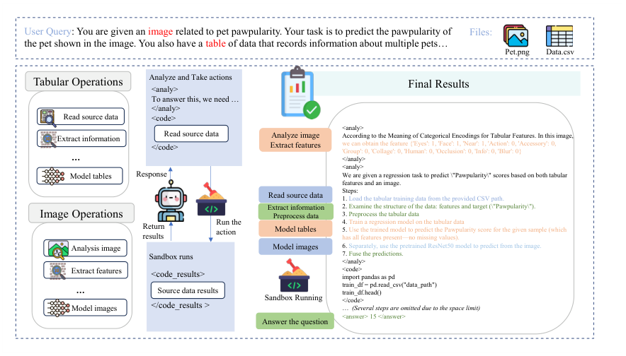

*原文 Fig. 3，PDF 第 5 页。原文表格工具推理交互流程；RL 训练细节见 §4.3。*

**原文证据：**

- [§4.3，PDF pp.5–6](https://arxiv.org/pdf/2603.24004v1)：TO-SFT 与 AL-GRPO；执行反馈掩码和成功代码动作的梯度。
- [§5.1，PDF p.7](https://arxiv.org/pdf/2603.24004v1)：SFT 1.5K+1.2K；RL 0.5K+0.4K；QA 视觉表头与 CSV 输入。
- [Fig.3，PDF p.5](https://arxiv.org/pdf/2603.24004v1)：原文神经符号工具交互流程。
- [论文元数据 / 版本记录](https://arxiv.org/abs/2603.24004)：标题、日期与公开版本来源；采用下述日期说明（如有）。

## Probing How Scalable Table Data Enhances General Long-Context Reasoning

**首次公开：** 2026-03-23 · **发表/版本：** arXiv · **类别：** text · **任务：** TQA

[论文](https://arxiv.org/abs/2603.21719) · [核对 PDF](https://arxiv.org/pdf/2603.21719v1) · 代码链接：未核实

**核对版本：** arXiv v1

**RL 方法：** GRPO / RLVR

把真实表格组织成可执行 SQL 环境，合成检索、计算与跨表关联问题；用 SQL 执行答案验证奖励，并保留成功率介于 0 与 1 的训练题。以 GRPO 训练长上下文推理模型。

| 阶段 | 数据与用途 |
| --- | --- |
| SFT / 冷启动 | 未新增 SFT；从 Qwen / DeepSeek-R1-Distill 系列模型直接进行 RL。 |
| RL 训练 | TableLong 合成 QA：BIRD、CoSQL、Spider 及文档抽取得到的 10,000+ 表格；每题组合 1–30 张表，构造中英双语、最长约 32K 上下文。未单列最终 QA 对总数。 |
| 评测 | LongBench v2、Loong、BrowseComp Long Context、MRCR、RULER、GSM-Infinite、Oolong；通用推理域外评测。 |

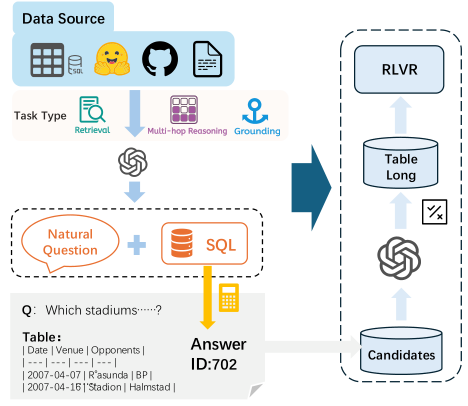

*原文 Fig. 1，PDF 第 3 页。TableLong 数据构造与可验证 RL 流程。*

**原文证据：**

- [§3.1–3.2，PDF pp.3–4](https://arxiv.org/pdf/2603.21719v1)：数据来自 10,000+ 表格；SQL 生成问题与可验证答案，过滤全对和全错题。
- [§4.1 / Appendix B](https://arxiv.org/pdf/2603.21719v1)：使用 GRPO；这里的 10,000+ 是表格数，不是 RL QA 对数。
- [Fig.1，PDF p.3](https://arxiv.org/pdf/2603.21719v1)：原文端到端数据构造和 RLVR 流程图。
- [论文元数据 / 版本记录](https://arxiv.org/abs/2603.21719)：标题、日期与公开版本来源；采用下述日期说明（如有）。

## TaREx: Reinforcement Learning for Code-Driven Table Reasoning

**首次公开：** 2026-03-14 · **发表/版本：** AAAI 2026 · **类别：** text · **任务：** TQA / TFV / Data Analysis

[论文](https://ojs.aaai.org/index.php/AAAI/article/view/40415) · [核对 PDF](https://ojs.aaai.org/index.php/AAAI/article/download/40415/44376) · 代码链接：未核实

**日期说明：** 正式论文发布日期；未核实更早预印本日期

**RL 方法：** GRPO + DAPO clip-higher

统一用 DataFrame 表示不同结构的表格，让策略在最多五轮交互中生成 Python、读取执行反馈并作答。使用 GRPO 的组内优势和 DAPO 非对称裁剪，以格式与答案奖励训练；过滤超时、无效和停滞轨迹来稳定更新。

| 阶段 | 数据与用途 |
| --- | --- |
| SFT / 冷启动 | 无额外 SFT 或蒸馏，直接对 Qwen2.5-7B-Instruct 做 RL。 |
| RL 训练 | 过滤后的 WikiTQ 9,472、MultiHiertt 5,119、FinQA 4,333、TAT-QA 8,085、HiTab 4,888、TabFact 15,087 条（共 46,984）。 |
| 评测 | 上述六个数据集与去除图像需求的 MultiModalQA 子集；域外含 RealHiTBench、AIT-QA、TableBench、TabularGSM、OTT-QA、FEVEROUS。 |

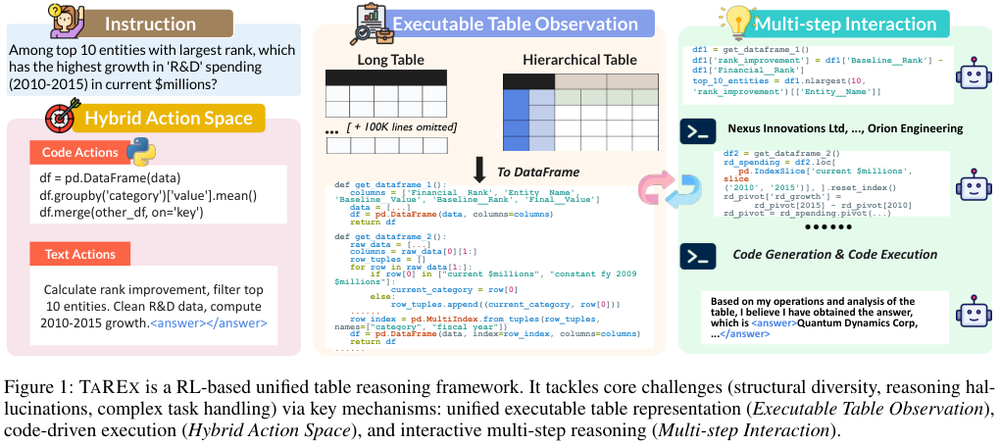

*原文 Fig. 1，PDF 第 2 页。统一表格观察、代码动作空间与多轮执行反馈框架。*

**原文证据：**

- [Publication metadata](https://ojs.aaai.org/index.php/AAAI/article/view/40415)：正式发布日期 2026-03-14。
- [RL Training Paradigm; Table 1; Training details; Figure 1](https://ojs.aaai.org/index.php/AAAI/article/download/40415/44376)：GRPO、0.1 格式 + 0.9 答案奖励、六个 RL 数据源；不使用 SFT。

**阅读备注：**

- MultiModalQA 只保留不需要图像的部分，模型输入为文本/DataFrame，因此归入文本表格理解。
- 未找到可核实的作者代码仓库，不猜测链接。

## Multimodal Table Understanding with Difficulty-aware Reinforcement Learning

**首次公开：** 2026-03-14 · **发表/版本：** AAAI 2026 · **类别：** multimodal · **任务：** TQA / TFV / TR

[论文](https://ojs.aaai.org/index.php/AAAI/article/view/37042) · [核对 PDF](https://ojs.aaai.org/index.php/AAAI/article/view/37042/41004) · 代码链接：未核实

**RL 方法：** Two-stage difficulty-aware GRPO

MM-Table-R1 先以 GRPO 学习 HTML 表格重建，以单元格内容和 rowspan/colspan 的面积加权正确率奖励感知；再用答案和格式奖励训练推理。课程难度结合合并单元格比例、单元格数与模型失败率。

| 阶段 | 数据与用途 |
| --- | --- |
| SFT / 冷启动 | 主方法不含独立 SFT；表格重建 Stage 1 也采用 RL。SFT 仅作为消融方案。 |
| RL 训练 | TabMWP、WTQ、HiTab、TAT-QA、FeTaQA、TabFact、InfoTabs、ToTTo，统一图像+HTML+QA；FeTaQA 经 DeepSeek-V3 拆分 QA。论文未公布各阶段来源样本数量。 |
| 评测 | TabMWP、WTQ、HiTab、TAT-QA、FeTaQA、TabFact、InfoTabs；ToTTo 重建；held-out TableVQA-Bench。 |

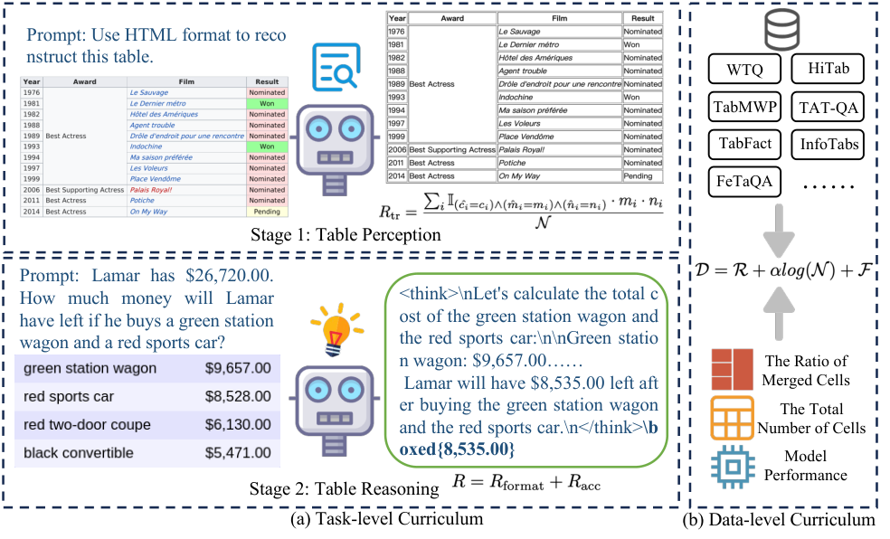

*原文 Fig. 2，PDF 第 4 页。Task curriculum from reconstruction to reasoning and sample difficulty curriculum.*

**原文证据：**

- [Published and bibliographic metadata](https://ojs.aaai.org/index.php/AAAI/article/view/37042)：Publisher publication date 14 March 2026; AAAI 40(1), 755–763.
- [Section 3, PDF pages 4–5](https://ojs.aaai.org/index.php/AAAI/article/view/37042/41004)：Both stages use GRPO; area-weighted reconstruction reward and difficulty-based curriculum.
- [Data Construction page 5; Evaluation Benchmarks page 6; Figure 2 page 4](https://ojs.aaai.org/index.php/AAAI/article/view/37042/41004)：Eight training sources; ToTTo used for reconstruction rather than table-to-text generation.

**阅读备注：**

- 日期为出版社公布日期，未找到可确认更早日期的预印本。
- ToTTo 在本论文评测的是 TR/重建（Rtr），不能标为 T2T。
- 未发现经作者确认的官方代码链接。

## Replacing Multi-Step Assembly of Data Preparation Pipelines with One-Step LLM Pipeline Generation for Table QA

**首次公开：** 2026-02-26 · **发表/版本：** arXiv · **类别：** text · **任务：** TQA / TFV

[论文](https://arxiv.org/abs/2602.22721) · [核对 PDF](https://arxiv.org/pdf/2602.22721v2) · [代码](https://github.com/ZJU-DAILY/Operation-R1)

**旧标题/别名：** Operation-R1

**核对版本：** arXiv v2, 2026-04-01

**RL 方法：** ORPO (Operation-wise Group Relative Policy Optimization)

一次生成 select/filter/sort/group/add-column 操作流水线，ORPO 用答案信息保留率、行列压缩和长度奖励训练预处理策略，并按组内奖励质量与方差重采样。推理时合并候选操作树、逐步回滚，交给下游模型作答。

| 阶段 | 数据与用途 |
| --- | --- |
| SFT / 冷启动 | 未报告额外 SFT；初始化 Qwen3 模型后用 LoRA 做 RL。 |
| RL 训练 | 主实验：WikiTQ 过滤后 5,403 条 cell-focused 样本，按 19:1 划分训练/验证。额外数据源实验：TabFact 5,000 条，LLM 标注终端推理所需单元格并做难度过滤。 |
| 评测 | WikiTQ 测试集；TabFact 域外主评测；FeTaQA、TableBench 为扩展评测。 |

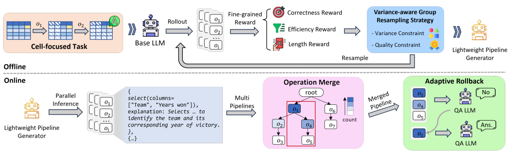

*原文 Fig. 2，PDF 第 5 页。ORPO 离线训练与候选合并/回滚的在线表格预处理。*

**原文证据：**

- [Submission history](https://arxiv.org/abs/2602.22721)：首次公开 2026-02-26；使用 v2。
- [Sections 3.2, 4.1, 4.6.2; Appendix A.2; Figure 2](https://arxiv.org/pdf/2602.22721v2)：Operation-wise GRPO 更新；5,403 个主 RL 样本和 19:1 划分，另有 TabFact 5,000 条数据源实验。
- [README / src/orm.py](https://github.com/ZJU-DAILY/Operation-R1)：作者公开 ORPO 奖励插件与训练入口。

**阅读备注：**

- ORPO 在这里不是 Odds Ratio Preference Optimization。
- PDF 中 PVLDB 模板年份/卷期为占位内容，未据此认定 VLDB 正式发表。
- 明确区分 WikiTQ 主训练与另做的 TabFact 数据源实验。

## Enhancing Table Reasoning with Deterministic Table-State Rewards

**首次公开：** 2026-01-30 · **发表/版本：** arXiv (v2 2026-05-15) · **类别：** text · **任务：** TQA

[论文](https://arxiv.org/abs/2601.22530) · [核对 PDF](https://arxiv.org/pdf/2601.22530v2) · [代码](https://github.com/ThomasK1018/RE_Tab)

**RL 方法：** GRPO proof-of-concept (main RE-Tab framework is training-free)

将操作后的中间表序列化为 header-is-value 文本，以查询与状态的最长公共子序列除以状态长度构成 TabROUGE 奖励。主框架用它指导推理和轨迹选择；v2 另用该确定性奖励对 Qwen3-8B 进行 GRPO 后训练。

| 阶段 | 数据与用途 |
| --- | --- |
| SFT / 冷启动 | 该 GRPO 实验未报告额外 SFT 阶段。 |
| RL 训练 | WikiTQ：200 条；MMQA：92 条；MMTU：92 条。WikiTQ/MMQA 训练 300 steps，MMTU 因 OOM 训练 150 steps（Appendix G.3）。 |
| 评测 | GRPO：WikiTQ、MMQA、MMTU held-out subsets；主 training-free 实验另外含 TableBench、TabFact。 |

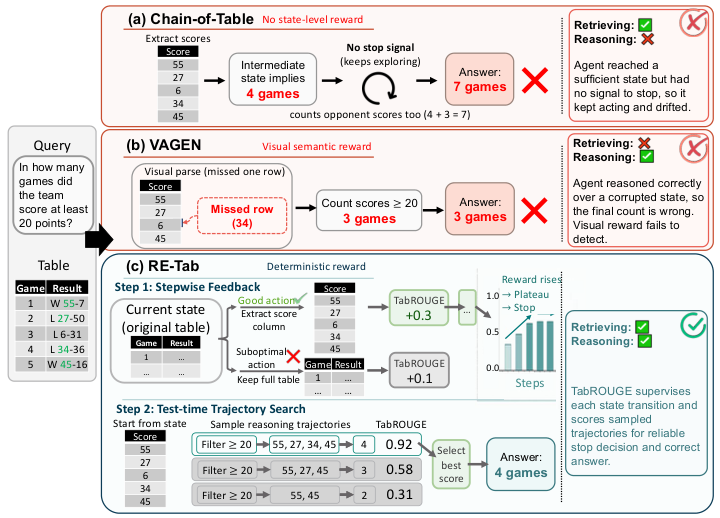

*原文 Fig. 1，PDF 第 2 页。RE-Tab state feedback and test-time trajectory search (panel c); this overview depicts the training-free reward mechanism, not a separate GRPO pipeline.*

**原文证据：**

- [Submission history](https://arxiv.org/abs/2601.22530)：First submitted 30 January 2026; latest version 15 May 2026.
- [Section 4.3 and Table 4](https://arxiv.org/html/2601.22530v2#S4.SS3)：Confirms policy-level GRPO post-training; cannot exclude it solely because main framework is training-free.
- [Appendix G.3: Datasets and steps](https://arxiv.org/html/2601.22530v2#A7.SS3)：Exact actual training subset counts and steps, plus GRPO implementation details.
- [Figure 1, PDF page 2](https://arxiv.org/pdf/2601.22530v2)：Original diagram explaining the state reward underlying the RL experiment.

**阅读备注：**

- 仅以 v2 的 GRPO proof-of-concept 纳入；主方法及大多数结果均为 training-free，不能写成整篇都用 RL 训练。
- MMQA/MMTU 的数据集名称不改变 Qwen3-8B 的文本表状态输入分类。
- TabFact 在主推理实验出现，但不在该论文的 GRPO 训练数据清单中。
- 公开仓库主要展示推理代理；论文中的 GRPO 配置以 Appendix G.3 为准。

## CoReTab: Improving Multimodal Table Understanding with Code-driven Reasoning

**首次公开：** 2026-01-27 · **发表/版本：** EACL 2026 Long · **类别：** multimodal · **任务：** TQA / TFV / TSU

[论文](https://aclanthology.org/2026.eacl-long.306/) · [核对 PDF](https://aclanthology.org/2026.eacl-long.306.pdf) · 代码链接：未核实

**RL 方法：** SFT + GRPO with separate LoRA adapters

将自然语言推理与可执行 Python 结合，先做表格识别和代码轨迹 SFT，再用答案正确性与格式奖励做 GRPO；三阶段分别更新 LoRA。推理时优先返回代码执行结果。

| 阶段 | 数据与用途 |
| --- | --- |
| SFT / 冷启动 | MMTab-pre 表格识别 150K；CoReTab 115K：WTQ 9.5K、HiTab 7.5K、TabMWP 30K、TAT-QA 6K、TabFact 22K、InfoTabs 15K，加五种结构任务各 5K。轨迹通过代码执行核验。 |
| RL 训练 | CoReTab 语料；原文未单列 RL 子集数量。GRPO 每题采样 4 条，奖励为二元答案正确性＋二元格式。 |
| 评测 | MMTab：TabMWP、WTQ、HiTab、TAT-QA、AIT-QA；TabFact、InfoTabs、PubHealthTab；表格尺寸、单元格提取／定位、合并单元格、行列提取及域外结构任务。 |

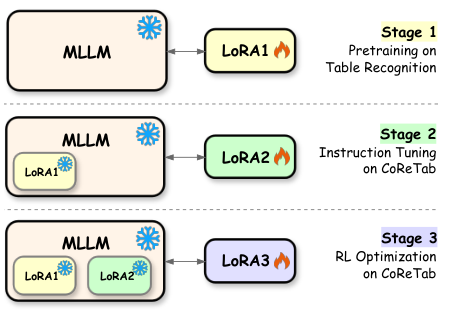

*原文 Fig. 3，PDF 第 5 页。三阶段 LoRA 训练：表格识别、CoReTab 指令微调与 GRPO 优化。*

**原文证据：**

- [Submission history](https://arxiv.org/abs/2601.19193)：首次公开 2026-01-27。
- [Publication metadata](https://aclanthology.org/2026.eacl-long.306/)：EACL 2026 正式发表。
- [Table 1; Sections 4.1, 5.1–5.2; Appendix B, Equations 2–4](https://aclanthology.org/2026.eacl-long.306.pdf)：训练数据来源；实际 GRPO 更新；二元答案与格式奖励；独立 LoRA 及 4 rollouts。
- [Figure 3, PDF page 5; Section 5.4 ablation](https://aclanthology.org/2026.eacl-long.306.pdf)：原始训练流程图；RL 阶段虽然称为 optional，但实验实际执行。

**阅读备注：**

- RL 阶段是在两阶段 SFT 之上追加的可选训练，论文包含移除 RL 的消融。
- 方法以代码执行核验数据和推理输出；RL 奖励公式只声明答案与格式，不虚构额外代码执行奖励。
- 未发现可核实的作者代码链接。

## ReasonTabQA: A Comprehensive Benchmark for Table Question Answering from Real World Industrial Scenarios

**首次公开：** 2026-01-12 · **发表/版本：** arXiv · **类别：** text · **任务：** TQA

[论文](https://arxiv.org/abs/2601.07280) · [核对 PDF](https://arxiv.org/pdf/2601.07280v1) · 代码链接：未核实

**RL 方法：** TabCodeRL / DAPO

用双语工业表格的 thinking 或 no-thinking 轨迹做冷启动，再用 DAPO 优化 Python 推理。奖励组合代码提取、执行与答案的分段分数、表路径选择，以及组内代码语义相似度，给复杂多表推理提供更细的反馈。

| 阶段 | 数据与用途 |
| --- | --- |
| SFT / 冷启动 | ReasonTabQA：总体 1,932 个标注实例，按 8:2 划分训练/测试；训练部分的一半用于 SFT，按模型选择 thinking 或 no-thinking 轨迹。 |
| RL 训练 | ReasonTabQA 训练部分的另一半，使用金标答案计算 TabCodeRL 奖励；原文未提供取整后的各子集准确样本数。 |
| 评测 | ReasonTabQA 测试集；WikiTQ、AIT-QA、MiMoTable、HiTab 为额外评测。 |

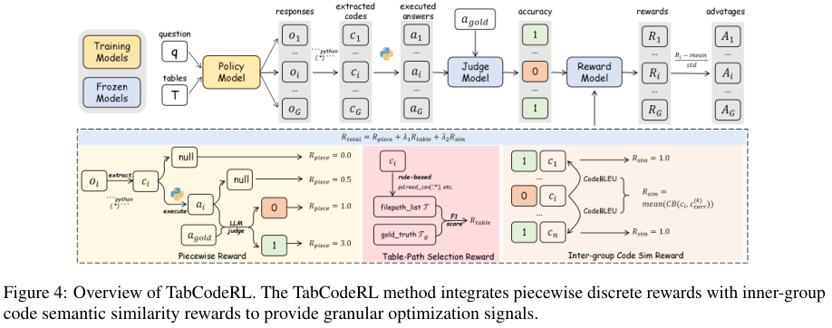

*原文 Fig. 4，PDF 第 6 页。TabCodeRL 的分段奖励与组内代码相似度优化流程。*

**原文证据：**

- [Submission history](https://arxiv.org/abs/2601.07280)：首次公开 2026-01-12。
- [Sections 4.1–4.3; Figure 4](https://arxiv.org/html/2601.07280v1#S4)：DAPO 更新和表感知可验证奖励。
- [Section 5.1; Appendix A](https://arxiv.org/html/2601.07280v1#S5.SS1)：8:2 训练测试划分，训练部分均分 SFT 与 RL。

**阅读备注：**

- 纳入的是基准论文中的实际 TabCodeRL 训练实验。
- 工业表格作为结构化文件输入；不是表格截图上的视觉 TQA。
- 尚未核实公开作者代码链接。

## TableGPT-R1: Advancing Tabular Reasoning Through Reinforcement Learning

**首次公开：** 2025-12-23 · **发表/版本：** arXiv · **类别：** text · **任务：** TQA / TFV

[论文](https://arxiv.org/abs/2512.20312) · [核对 PDF](https://arxiv.org/pdf/2512.20312v2) · 代码链接：未核实

**核对版本：** arXiv v2，2025-12-25

**RL 方法：** SFT + 三阶段 GRPO++

以少量 SFT 热启动，再按通用推理、表格工具交互和困难样本三阶段训练。GRPO++ 使用序列重要性权重、解耦裁剪和熵正则；奖励结合可执行答案规则、注入评价标准的模型评判及中间代码执行反馈。

| 阶段 | 数据与用途 |
| --- | --- |
| SFT / 冷启动 | 约占整体训练池 3% 的热启动样本；训练池绝对规模未报告。 |
| RL 训练 | 公开通用推理数据 + 合成表格代理 QA；通过多模型答案一致性筛选及 pass@k 难度过滤进入后续阶段。原文未完整公开各数据集名称与分项数量。 |
| 评测 | TableBench（含事实验证）、内部表格代理 QA；Spider/BIRD、LiveCodeBench 与通用推理基准。 |

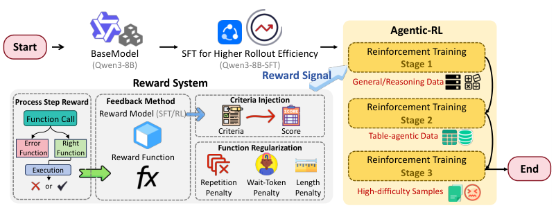

*原文 Fig. 2，PDF 第 4 页。TableGPT-R1 分阶段训练、奖励与优化框架。*

**原文证据：**

- [§2 / Fig.2，PDF pp.3–4；GRPO++ 与奖励，PDF pp.8–10](https://arxiv.org/pdf/2512.20312v2)：SFT 与三阶段 GRPO++；规则、评价标准注入奖励及步骤反馈。
- [§3.5，PDF pp.10–11](https://arxiv.org/pdf/2512.20312v2)：合成表格 QA、一致性筛选、3% SFT 热启动和困难题选择；绝对训练量未完整披露。
- [TableBench 实验 / Appendix](https://arxiv.org/pdf/2512.20312v2)：表格 QA 与事实验证实验，不能将所有评测集自动填入 RL 数据列。
- [论文元数据 / 版本记录](https://arxiv.org/abs/2512.20312)：标题、日期与公开版本来源；采用下述日期说明（如有）。

**阅读备注：**

- 作者发布模型 https://huggingface.co/tablegpt/TableGPT-R1；未核实到官方训练代码仓库。

## JT-DA: Enhancing Data Analysis with Tool-Integrated Table Reasoning Large Language Models

**首次公开：** 2025-12-07 · **发表/版本：** arXiv · **类别：** text · **任务：** TQA

[论文](https://arxiv.org/abs/2512.06859) · [核对 PDF](https://arxiv.org/pdf/2512.06859v1) · [代码](https://github.com/JT-LM/JT-DA-8B)

**核对版本：** arXiv v1

**RL 方法：** 多模式 SFT + GRPO

构造文本 CoT、程序 PoT 与交织 ICoT 的表格分析轨迹，经质量评分和任务平衡后做 SFT；再对新的表格任务用无 KL 的 token 级 GRPO，以回答正确性和推理格式奖励提升沙箱工具推理。

| 阶段 | 数据与用途 |
| --- | --- |
| SFT / 冷启动 | 汇集 29 个公开表格数据集（如 AIT-QA、ToTTo、HybridQA、TableBench）及约 300 万张原始表，合成并筛选 34 类任务轨迹；300 万是表格数，并非最终 SFT 样本数。 |
| RL 训练 | 约 3,000 条未用于此前训练阶段的新表格任务 QA；提供部分结构与 CSV 路径，支持沙箱读取大表。 |
| 评测 | TReB：表格理解、基础操作、计算、数据分析、高级数据分析，比较 TCoT/PoT/ICoT。 |

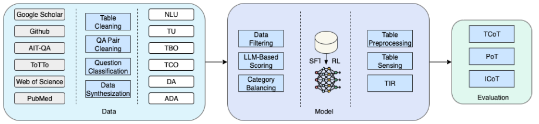

*原文 Fig. 2，PDF 第 3 页。JT-DA 整体数据、训练与表格代理架构。*

**原文证据：**

- [§2.2，PDF pp.6–7](https://arxiv.org/pdf/2512.06859v1)：29 个公开数据集与约 300 万张表的来源；最终轨迹另经生成与过滤。
- [§5.1–5.3，PDF p.15](https://arxiv.org/pdf/2512.06859v1)：约 3,000 新 QA、GRPO token 级目标，去除 KL；答案和格式奖励。
- [§7.1.1 / Table 3，PDF pp.19–20](https://arxiv.org/pdf/2512.06859v1)：TReB 任务与 SFT/RL 模型对照。
- [Fig.2，PDF p.3](https://arxiv.org/pdf/2512.06859v1)：原文整体框架。
- [论文元数据 / 版本记录](https://arxiv.org/abs/2512.06859)：标题、日期与公开版本来源；采用下述日期说明（如有）。

## STaR: Towards Effective and Stable Table Reasoning via Slow-Thinking Large Language Models

**首次公开：** 2025-11-14 · **发表/版本：** The Web Conference 2026 · **类别：** text · **任务：** TQA / TFV

[论文](https://arxiv.org/abs/2511.11233) · [核对 PDF](https://arxiv.org/pdf/2511.11233v2) · [代码](https://github.com/ustc-table-mining/STaR)

**旧标题/别名：** STaR: Towards Cognitive Table Reasoning via Slow-Thinking Large Language Models

**RL 方法：** Difficulty-aware enhanced GRPO (DAPO variant)

自验证筛选慢思考轨迹做 SFT，随后用带非对称裁剪的 GRPO 先训练容易样本，再动态筛选困难样本。格式、部分重合与完整答案奖励缓解稀疏反馈；推理时融合 token 置信度和答案一致性选择轨迹。

| 阶段 | 数据与用途 |
| --- | --- |
| SFT / 冷启动 | WikiTableQuestions、HiTab、FinQA 的训练划分，经自验证的慢思考轨迹。 |
| RL 训练 | 相同三个数据集的训练划分，依据 pass@k 分为 easy/hard，并对 hard 子集动态筛选。 |
| 评测 | WTQ、HiTab、FinQA 测试集；TabMWP、TabFact 为域外评测，仅推理。 |

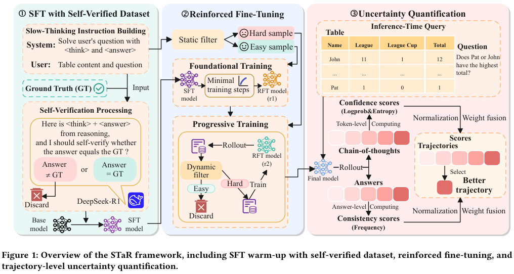

*原文 Fig. 1，PDF 第 3 页。自验证 SFT、难度感知 RL 与不确定性轨迹选择。*

**原文证据：**

- [Submission history](https://arxiv.org/abs/2511.11233)：首次公开 2025-11-14；采用更名后的 v2（2026-01-26）。
- [Sections 3.2–3.3, 4.1; Appendix B.1; Figure 1](https://arxiv.org/pdf/2511.11233v2)：增强 GRPO 和训练数据难度划分；最新版本明确测试集只评测。
- [Publication metadata](https://doi.org/10.1145/3774904.3792372)：The Web Conference 2026 正式发表与当前标题。

**阅读备注：**

- TabFact 只用于域外评测，未用于本文 RL 训练。
- 旧 v1 的附录对测试集用途措辞不同；本条按 v2 的训练划分与说明记录。

## Mixture-of-Minds: Multi-Agent Reinforcement Learning for Table Understanding

**首次公开：** 2025-10-23 · **发表/版本：** ACL 2026 Main · **类别：** text · **任务：** TQA / TFV / Data Analysis

[论文](https://aclanthology.org/2026.acl-long.112/) · [核对 PDF](https://aclanthology.org/2026.acl-long.112.pdf) · [代码](https://github.com/Tonyzhou98/mixture-of-minds)

**RL 方法：** Sequential multi-agent GRPO

把表格推理拆成规划、代码执行、作答三个代理。MCTS 式分支采样从答对的路径回溯出伪金标计划与代码，再依次用 GRPO 优化三个代理；奖励分别衡量计划相似度、代码执行与操作质量、最终答案正确性。

| 阶段 | 数据与用途 |
| --- | --- |
| SFT / 冷启动 | 本文代理训练流程未单列额外 SFT 阶段；成功 rollout 生成的伪金标用于 GRPO 奖励。 |
| RL 训练 | TableInstruct：4,897 个去重 QA，经答案一致性与人工核对清洗；MCTS 式 rollout 生成计划、代码、答案训练实例。 |
| 评测 | TableBench 的 Fact Checking/Numerical Reasoning/Data Analysis（836 题）；FinQA 为域外评测。 |

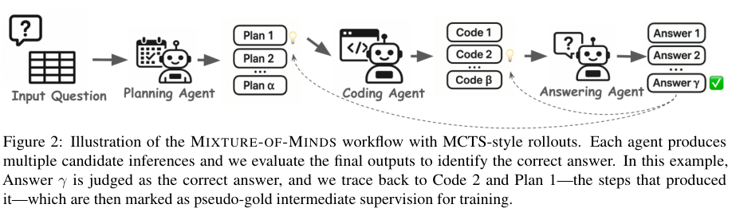

*原文 Fig. 2，PDF 第 5 页。MCTS 式规划、代码和答案分支，以及成功路径的伪金标回溯。*

**原文证据：**

- [Submission history](https://arxiv.org/abs/2510.20176)：首次公开 2025-10-23。
- [Sections 4.1–4.2, 5.1; Appendix C; Figure 2](https://aclanthology.org/2026.acl-long.112.pdf)：顺序 GRPO、各代理奖励与 TableInstruct 数据来源；采用 ACL 正式版本。

**阅读备注：**

- MCTS 用于生成训练信号；策略更新使用 GRPO。
- 评测集不列作 RL 数据；TableInstruct 原始来源可能含同名基准，需按原文划分理解域外结论。

## Imbalanced Gradients in RL Post-Training of Multi-Task LLMs

**首次公开：** 2025-10-22 · **发表/版本：** Findings of EACL 2026 · **类别：** text · **任务：** TQA

[论文](https://aclanthology.org/2026.findings-eacl.164/) · [核对 PDF](https://aclanthology.org/2026.findings-eacl.164.pdf) · 代码链接：未核实

**日期说明：** 首次预印本：2025-10-22，https://arxiv.org/abs/2510.19178；方法与图采用正式 EACL 2026 版本。

**RL 方法：** GRPO / RLVR；任务采样对比

研究多任务 RL 中各任务梯度尺度不均衡：在 FinQA、数学、代码与算术混合训练中比较均匀采样和按梯度范数分配的采样，分析采样权重如何影响各任务学习。没有提出新的表格专用 RL 算法。

| 阶段 | 数据与用途 |
| --- | --- |
| SFT / 冷启动 | 未新增 SFT；从 Qwen2.5 / Llama-3.2 指令模型进行 RL。 |
| RL 训练 | 跨域混合：FinQA、R1-Code、Countdown、MATH；另有 DeepScaleR/MATH/Arithmetic 单域分析。原文未统一给出最终训练池数量。 |
| 评测 | FinQA、代码、Countdown、MATH-500 等相应留出评测；另有单域梯度分析。 |

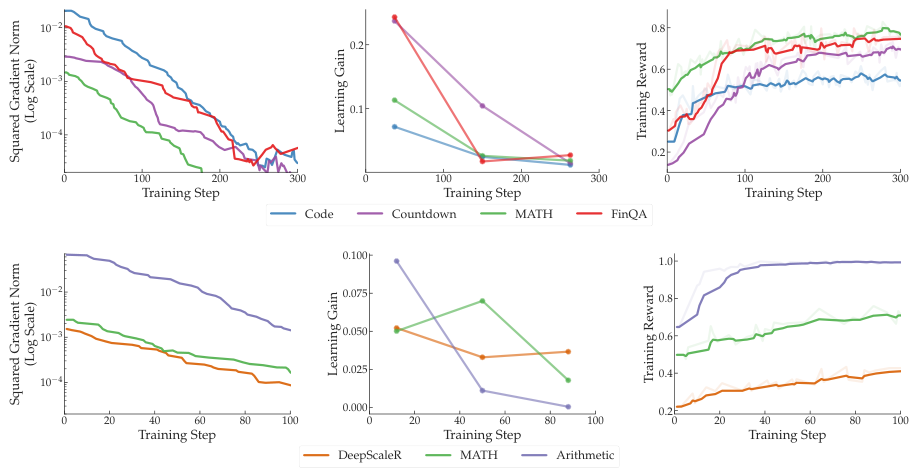

*原文 Fig. 1，PDF 第 2 页。原文 RL 训练诊断图，展示不同任务训练行为；论文没有独立方法架构图。*

**原文证据：**

- [§2，PDF pp.2–3](https://aclanthology.org/2026.findings-eacl.164.pdf)：多任务 GRPO 训练明确包含金融文本和表格 QA 的 FinQA。
- [§3 / Appendix C](https://aclanthology.org/2026.findings-eacl.164.pdf)：均匀与梯度范数驱动采样的实验设置；没有宣称采样在所有任务稳定提高性能。
- [Fig.1，PDF p.2](https://aclanthology.org/2026.findings-eacl.164.pdf)：原文训练诊断图，作为无独立架构图论文的明确替代。
- [论文元数据 / 版本记录](https://aclanthology.org/2026.findings-eacl.164/)：标题、日期与公开版本来源；采用下述日期说明（如有）。

## Towards Efficient Multimodal Unified Reasoning Model via Model Merging

**首次公开：** 2025-10-10 · **发表/版本：** CVPR Findings 2026 · **类别：** multimodal · **任务：** TQA / TFV

[论文](https://openaccess.thecvf.com/content/CVPR2026F/html/Yin_Towards_Efficient_Multimodal_Unified_Reasoning_Model_via_Model_Merging_CVPRF_2026_paper.html) · [核对 PDF](https://openaccess.thecvf.com/content/CVPR2026F/papers/Yin_Towards_Efficient_Multimodal_Unified_Reasoning_Model_via_Model_Merging_CVPRF_2026_paper.pdf) · [代码](https://github.com/buptyqx/Tiny-R1V)

**旧标题/别名：** Tiny-R1V

**日期说明：** 预印本首次提交 2025-10-10：https://arxiv.org/abs/2510.08987；图与方法采用 CVPR Findings 2026 正式 PDF。

**代码状态：** 作者 GitHub 仓库目前为占位，训练代码未发布。

**RL 方法：** Length-Informed Relative Policy Optimization（LIPO）+ AMM

分别以 LIPO 训练数学、结构数据和 OCR 专家，按回答长度调整奖励与相对优势，偏向简洁而正确的推理；再用 AMM 合并专家任务向量。强化学习发生在专家训练阶段，模型合并阶段不做 RL。

| 阶段 | 数据与用途 |
| --- | --- |
| SFT / 冷启动 | 未新增冷启动 SFT；从 Qwen2.5-VL-3B-Instruct 直接训练三个专家。 |
| RL 训练 | 结构数据专家 15K：TAT-DQA、WTQ、TabFact、PlotQA、TQA、ChartGalaxy；另有数学专家 15K 和 OCR 专家 10K。15K 是混合结构数据量，并非全部为表格 QA。 |
| 评测 | 主结果结构数据评测为 ChartQA/CharXiv；另有数学、OCR、通用多模态基准。未单列 WTQ/TabFact 留出测试结果。 |

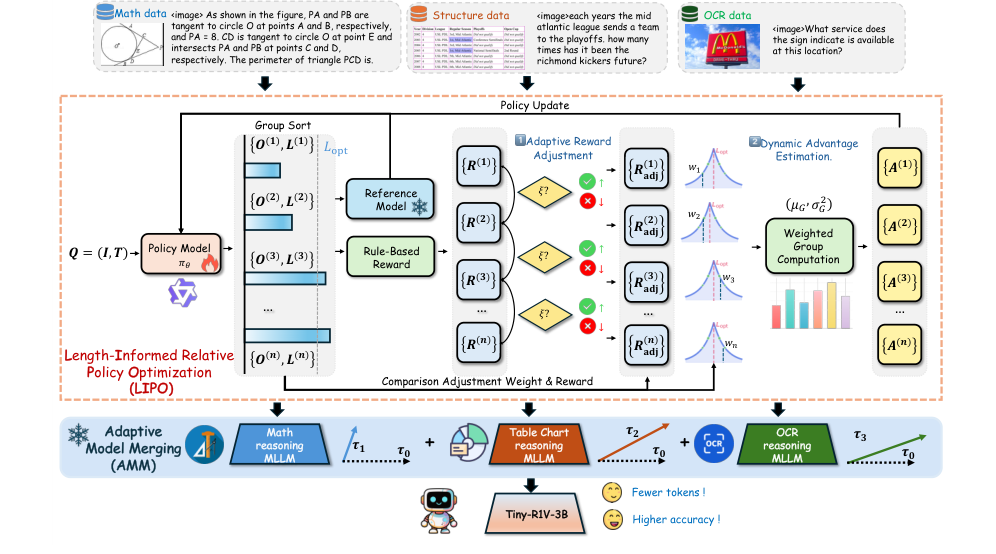

*原文 Fig. 2，PDF 第 4 页。LIPO 专家训练与 AMM 合并的 Tiny-R1V 方法。*

**原文证据：**

- [§3 / Fig.2，PDF pp.3–5](https://openaccess.thecvf.com/content/CVPR2026F/papers/Yin_Towards_Efficient_Multimodal_Unified_Reasoning_Model_via_Model_Merging_CVPRF_2026_paper.pdf)：LIPO 的长度奖励/优势调整与 AMM 两阶段框架。
- [§4.1 / Table 2，PDF p.6](https://openaccess.thecvf.com/content/CVPR2026F/papers/Yin_Towards_Efficient_Multimodal_Unified_Reasoning_Model_via_Model_Merging_CVPRF_2026_paper.pdf)：明确 WTQ、TabFact 等结构数据专家 RL 来源；无冷启动。
- [Table 1，PDF p.5](https://openaccess.thecvf.com/content/CVPR2026F/papers/Yin_Towards_Efficient_Multimodal_Unified_Reasoning_Model_via_Model_Merging_CVPRF_2026_paper.pdf)：主结果评测以图表等为主，没有单列 WTQ/TabFact 测试。
- [论文元数据 / 版本记录](https://openaccess.thecvf.com/content/CVPR2026F/html/Yin_Towards_Efficient_Multimodal_Unified_Reasoning_Model_via_Model_Merging_CVPRF_2026_paper.html)：标题、日期与公开版本来源；采用下述日期说明（如有）。

**阅读备注：**

- 作者仓库当前主要提供论文、说明和图；训练代码未发布。仓库整理的数据源文件规模不是 Table 2 的实际抽样训练数量。

## TaTToo: Tool-Grounded Thinking PRM for Test-Time Scaling in Tabular Reasoning

**首次公开：** 2025-10-07 · **发表/版本：** ICLR 2026 · **类别：** text · **任务：** TQA / TFV / Data Analysis

[论文](https://openreview.net/forum?id=zc1ezBrr5m) · [核对 PDF](https://cdn.amazon.science/fb/17/2cafd7404010bf50b4015bba4654/camera-ready-iclr-2026-tableprm.pdf) · 代码链接：未核实

**核对版本：** ICLR 2026 camera-ready, 28 pages

**RL 方法：** Modified GRPO with dense step-level reward shaping

训练可生成验证理由、调用 Python/SQL 与表格检索工具的 PRM。SFT 学会区域前缀与工具验证，再用 GRPO 优化标签匹配、置信度校准及工具证据支持；推理时给回答策略的候选轨迹打分，支持 Best-of-N 和树搜索。

| 阶段 | 数据与用途 |
| --- | --- |
| SFT / 冷启动 | TableInstruct、HybridQA、ToTTo、WikiTQ 的专家推理轨迹，经 LLM/人工核验和工具调用合成约 60K 步级验证实例；Table 8 的 SFT 阶段使用 50K。 |
| RL 训练 | 上述合成的步级验证语料中 10K（Table 8），用于 PRM 的 GRPO；训练对象是验证器。 |
| 评测 | TableBench Numerical Reasoning / Fact Checking / Data Analysis；WikiTQ；MMQA 多表理解基准（此处不是 MultiModalQA）。 |

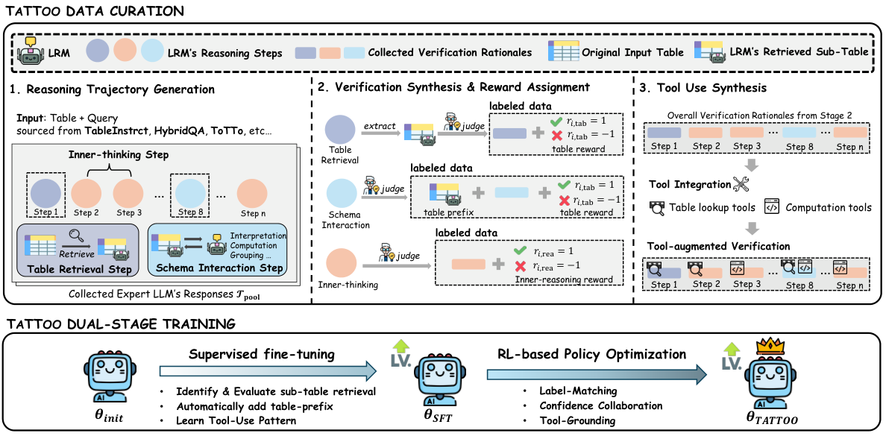

*原文 Fig. 1，PDF 第 1 页。工具辅助数据合成与 SFT→RL 双阶段 PRM 训练。*

**原文证据：**

- [Submission history](https://arxiv.org/abs/2510.06217)：首次公开 2025-10-07。
- [Publication metadata](https://openreview.net/forum?id=zc1ezBrr5m)：ICLR 2026 正式发表。
- [Sections 4.2–4.3, 5; Table 8, PDF p.25; Figure 1](https://cdn.amazon.science/fb/17/2cafd7404010bf50b4015bba4654/camera-ready-iclr-2026-tableprm.pdf)：实际 GRPO 更新验证器；四个原始语料源、50K SFT / 10K RL，以及评测基准。

**阅读备注：**

- 纳入 RL 训练的表格验证器；下游回答策略在本方法中主要通过测试时搜索提升，而非本工作对它做 RL。
- ToTTo 是验证语料来源，不据此标成本文 T2T 评测。
- 尚未核实公开作者代码仓库。

## Two-Stage Training with Reinforcement Learning for Vietnamese Financial Numerical Reasoning

**首次公开：** 2025-10 · **发表/版本：** VLSP 2025 · **类别：** text · **任务：** TQA

[论文](https://aclanthology.org/2025.vlsp-1.28/) · [核对 PDF](https://aclanthology.org/2025.vlsp-1.28.pdf) · 代码链接：未核实

**日期说明：** 使用 ACL Anthology 正式会议月份 2025-10；未核实更早预印本。

**RL 方法：** LoRA SFT + GRPO

Qwen3 先学习越南语金融程序生成，再以 GRPO 强化：程序执行失败为 −2、执行答案正确为 +1、其他为 0。最终方案保留完整 Markdown 表格及前后文，避免检索裁剪丢失运算依据。

| 阶段 | 数据与用途 |
| --- | --- |
| SFT / 冷启动 | VLSP 2025 Vietnamese Financial Numerical Reasoning train：2,993 条，含翻译 FinQA 和越南语财务报告来源。 |
| RL 训练 | 同一 VLSP train（2,993 条），在 SFT 后进行一轮 GRPO；每提示采样 4 个程序。 |
| 评测 | VLSP validation 584 / public-test 497；公开测试程序与执行准确性。 |

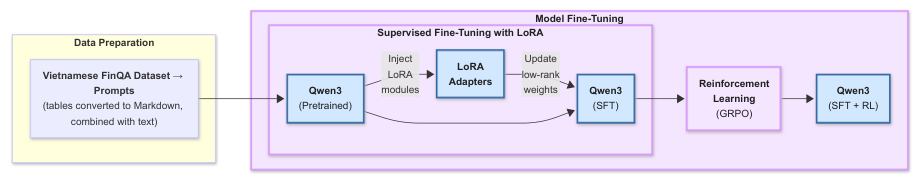

*原文 Fig. 1，PDF 第 3 页。越南语金融数值推理两阶段训练框架。*

**原文证据：**

- [§3 / Table 1，PDF pp.2–3](https://aclanthology.org/2025.vlsp-1.28.pdf)：VLSP 全集 4,074，划分 2,993/584/497。
- [§4.2，PDF pp.3–4](https://aclanthology.org/2025.vlsp-1.28.pdf)：LoRA SFT 后 GRPO；执行结果奖励 −2/0/+1。
- [Fig.1，PDF p.3](https://aclanthology.org/2025.vlsp-1.28.pdf)：原文两阶段方法图。
- [论文元数据 / 版本记录](https://aclanthology.org/2025.vlsp-1.28/)：标题、日期与公开版本来源；采用下述日期说明（如有）。

## MoFin: A Small Vietnamese Language Model for Financial Reasoning via Reinforcement Learning

**首次公开：** 2025-10 · **发表/版本：** VLSP 2025 · **类别：** text · **任务：** TQA

[论文](https://aclanthology.org/2025.vlsp-1.27/) · [核对 PDF](https://aclanthology.org/2025.vlsp-1.27.pdf) · 代码链接：未核实

**日期说明：** 可核实的 ACL Anthology 正式会议时间为 2025 年 10 月；未核实到更早预印本日期。

**RL 方法：** CoT SFT + GRPO

翻译并核验 FinQA 金融表格与推理程序，蒸馏执行正确的 CoT 后做 LoRA SFT；GRPO 结合格式、程序匹配和执行结果奖励，提升越南语金融数值推理。

| 阶段 | 数据与用途 |
| --- | --- |
| SFT / 冷启动 | VLSP 官方 540 条 + 翻译 FinQA 3,247 条，含蒸馏 CoT。§3.3.1 报告总数 3,747，但分项合计 3,787，原文不一致。 |
| RL 训练 | 从上述金融 QA 池按提示长度筛选（第 19 百分位阈值）后做 GRPO；未单列最终 RL 数量。 |
| 评测 | VLSP 2025 Financial Numerical Reasoning 隐藏测试；程序准确性与执行准确性。 |

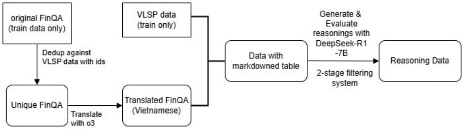

*原文 Fig. 1，PDF 第 3 页。原文越南语金融训练数据构造图；未提供独立 RL 框图。*

**原文证据：**

- [§3.2 / Fig.1，PDF p.3](https://aclanthology.org/2025.vlsp-1.27.pdf)：FinQA 翻译、蒸馏与执行校验的数据构造流程。
- [§3.3.1，PDF p.4](https://aclanthology.org/2025.vlsp-1.27.pdf)：正文总数 3,747 与 540+3,247 的分项不一致，保留差异。
- [§3.3.2，PDF pp.4–5](https://aclanthology.org/2025.vlsp-1.27.pdf)：实际 GRPO 与程序/执行/格式奖励，提示长度筛选。
- [论文元数据 / 版本记录](https://aclanthology.org/2025.vlsp-1.27/)：标题、日期与公开版本来源；采用下述日期说明（如有）。

**阅读备注：**

- 训练规模的正文和分项存在差异，不能自行选择其中一个作为无争议的最终总数。

## Enhancing Numerical Reasoning in Vietnamese Financial Question Answering through Program-Centric Policy Optimization

**首次公开：** 2025-10 · **发表/版本：** VLSP 2025 · **类别：** text · **任务：** TQA

[论文](https://aclanthology.org/2025.vlsp-1.26/) · [核对 PDF](https://aclanthology.org/2025.vlsp-1.26.pdf) · [代码](https://github.com/duccd4/vlsp2025-financial-numerical-reasoning)

**日期说明：** 使用 ACL Anthology 正式会议月份 2025-10；未核实更早预印本。

**RL 方法：** CoNR SFT + PCPO 奖励 / GRPO

教师模型生成 Chain-of-Numerical-Reasoning 轨迹供 SFT；GRPO 用程序可执行性、答案匹配和简洁性组成 PCPO 奖励，先通过有效程序门控，再优化数值正确性与输出长度。PCPO 是奖励设计，实际优化算法为 GRPO。

| 阶段 | 数据与用途 |
| --- | --- |
| SFT / 冷启动 | VLSP 2025 train（2,993）+ 越南语翻译并程序重增强的 FinQA，论文报告 CoNR SFT 共 14,661 条。 |
| RL 训练 | 上述金融问答训练池用于程序中心 GRPO；未单列 RL 筛选后样本数。 |
| 评测 | VLSP 验证 584、公开测试 497、私有测试 1,625。 |

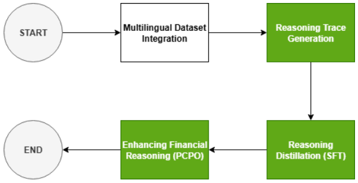

*原文 Fig. 1，PDF 第 3 页。CoNR 蒸馏、SFT 与 GRPO 的整体框架。*

**原文证据：**

- [§3.1 / Table 1，PDF pp.2–3](https://aclanthology.org/2025.vlsp-1.26.pdf)：将 FinQA train/validation/public-test 合并后用于翻译和训练增强。
- [§3.2–3.4，PDF pp.3–5](https://aclanthology.org/2025.vlsp-1.26.pdf)：CoNR 数据规模、SFT、PCPO 奖励及 GRPO 更新。
- [Fig.1，PDF p.3](https://aclanthology.org/2025.vlsp-1.26.pdf)：原文训练方法流程图。
- [论文元数据 / 版本记录](https://aclanthology.org/2025.vlsp-1.26/)：标题、日期与公开版本来源；采用下述日期说明（如有）。

**阅读备注：**

- 原文将 FinQA 验证/公开测试划入训练来源；不能将这些划分再视作独立 FinQA 测试。
- 报告总数 14,661 与所列 VLSP 2,993 + 增强 FinQA 11,688（合计 14,681）不一致，未自行修正。

## DeFacto: Counterfactual Thinking with Images for Enforcing Evidence-Grounded and Faithful Reasoning

**首次公开：** 2025-09-25 · **发表/版本：** arXiv · **类别：** multimodal · **任务：** TQA

[论文](https://arxiv.org/abs/2509.20912) · [核对 PDF](https://arxiv.org/pdf/2509.20912v4) · [代码](https://github.com/tinnel123666888/defacto)

**核对版本：** arXiv v4，2026-05-21

**RL 方法：** 反事实对齐 + Counterfactual GRPO

为图像问题构造原图、关键证据遮挡图和随机非关键遮挡图；GRPO 联合答案、格式与证据框奖励，让关键证据缺失时输出 Unknown，并约束回答依赖真实图像证据。在视觉 WTQ 上评测表格问答迁移。

| 阶段 | 数据与用途 |
| --- | --- |
| SFT / 冷启动 | Table 4 消融包含原始数据 SFT 和反事实对齐；所列版本未单列 SFT 数据量或阶段配比。 |
| RL 训练 | DeFacto-100K（约 10 万图像；VQAv2、ChartQA、DocVQA 等来源），构造正样本/关键遮挡/随机遮挡三类训练输入；未单列 WTQ 训练占比。 |
| 评测 | 视觉 WikiTableQuestions（Table 3）；DeFacto-1.5K 含 100 条 WTQ 与其他 14 个视觉任务，属于评测集。 |

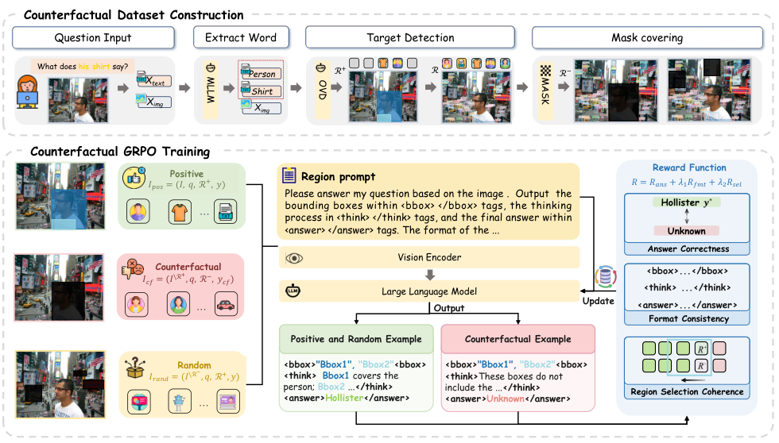

*原文 Fig. 2，PDF 第 4 页。证据定位、反事实遮挡与 GRPO 的整体方法。*

**原文证据：**

- [§3.2，PDF pp.3–4](https://arxiv.org/pdf/2509.20912v4)：DeFacto-100K 来源和反事实证据遮挡；没有报告 WTQ 专属 RL 训练量。
- [§3.3 / Fig.2，PDF pp.4–5](https://arxiv.org/pdf/2509.20912v4)：实际 GRPO、答案与视觉证据奖励。
- [Tables 3–4，PDF pp.7–8](https://arxiv.org/pdf/2509.20912v4)：WTQ 表格问答评测及 SFT/反事实对齐/GRPO 消融。
- [论文元数据 / 版本记录](https://arxiv.org/abs/2509.20912)：标题、日期与公开版本来源；采用下述日期说明（如有）。

**阅读备注：**

- DeFacto-1.5K 是评测集，不可填入训练数据。

## Can GRPO Boost Complex Multimodal Table Understanding?

**首次公开：** 2025-09-21 · **发表/版本：** EMNLP 2025 · **类别：** multimodal · **任务：** TQA / TFV / TR

[论文](https://aclanthology.org/2025.emnlp-main.637/) · [核对 PDF](https://aclanthology.org/2025.emnlp-main.637.pdf) · 代码链接：未核实

**RL 方法：** SFT warm-up + PA-GRPO + HC-GRPO

Table-R1 三阶段训练：SFT 热身提升感知与推理起点，PA-GRPO 用 TEDS 连续奖励优化图像到 HTML/Markdown，HC-GRPO 在给定部分推理提示后补全剩余步骤，以最终答案正确性与格式奖励缓解稀疏反馈。

| 阶段 | 数据与用途 |
| --- | --- |
| SFT / 冷启动 | MMTab 中 WTQ、HiTab、TabMWP、TabFact 各抽 8K QA；感知目标为结构化表格，推理目标由 GPT-4o 扩写并拆成 hint-completion。 |
| RL 训练 | 相同四个 held-in 来源；PA-GRPO 用图像重建数据 Dp，HC-GRPO 用 hint-completion 推理数据 Dr。 |
| 评测 | held-in WTQ、HiTab、TabMWP、TabFact；held-out TAT-QA、InfoTabs。 |

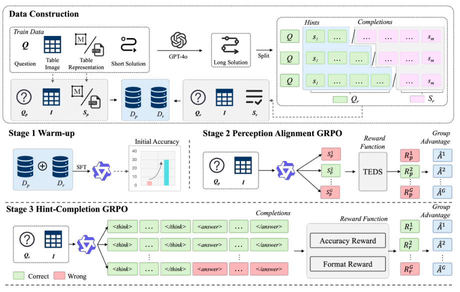

*原文 Fig. 2，PDF 第 4 页。Warm-up, TEDS-based perception alignment and hinted reasoning completion.*

**原文证据：**

- [Submission history](https://arxiv.org/abs/2509.16889)：First submitted 21 September 2025.
- [Section 4.2, pages 4–5; Table 2, page 6](https://aclanthology.org/2025.emnlp-main.637.pdf)：SFT and two actual GRPO stages; four training datasets distinct from two held-out datasets.
- [Section 5.2, pages 6–7; Figure 2, page 4; Limitations page 10](https://aclanthology.org/2025.emnlp-main.637.pdf)：T2T explicitly excluded; HC-GRPO reward remains binary answer correctness plus format.

**阅读备注：**

- HC-GRPO 的最终奖励仍是答案/格式二值信号，并非逐步正确性标签的过程奖励模型。
- TAT-QA 与 InfoTabs 是 held-out，不能列为训练集。
- 同名 Table-R1 的文本/区域强化学习论文需单独去重；未发现官方代码链接。

## TableMind: An Autonomous Programmatic Agent for Tool-Augmented Table Reasoning

**首次公开：** 2025-09-08 · **发表/版本：** arXiv（v4 原文标注 WSDM 2026） · **类别：** text · **任务：** TQA / TFV

[论文](https://arxiv.org/abs/2509.06278) · [核对 PDF](https://arxiv.org/pdf/2509.06278v4) · [代码](https://github.com/ustc-table-mining/TableMind)

**核对版本：** arXiv v4，2026-07-26

**RL 方法：** 轨迹 SFT + RAPO

代理循环执行规划、Python 工具调用与反思。少量正确轨迹热启动后，RAPO 增强被当前策略低估的高质量轨迹优势；联合格式、答案准确性、工具成功及轮次成本奖励训练自主表格推理。

| 阶段 | 数据与用途 |
| --- | --- |
| SFT / 冷启动 | 200 条经过筛选的合成多轮工具推理轨迹。 |
| RL 训练 | 按 Table 1：TabFact 3,500 + TabMWP 3,500 + WikiTQ 1,000，共 8,000；正文对来源的描述存在不一致，见证据卡。 |
| 评测 | TabFact、TabMWP、WikiTQ；HiTab、FinQA 域外测试（按 Table 1）。 |

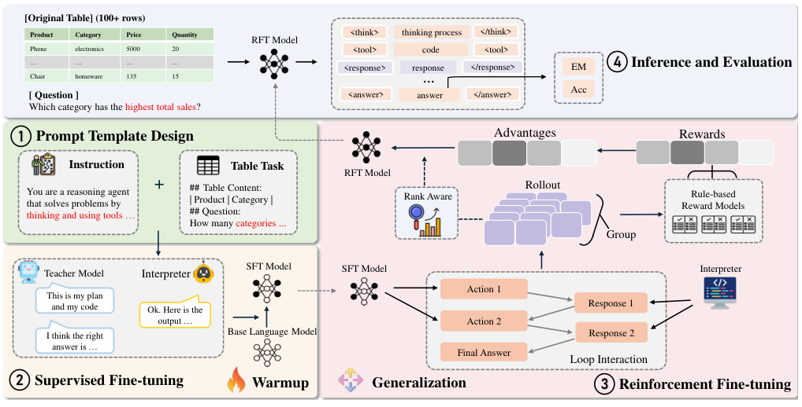

*原文 Fig. 2，PDF 第 4 页。TableMind 代理交互与两阶段训练。*

**原文证据：**

- [§4 / Fig.2，PDF pp.3–4；Implementation Details，PDF p.6](https://arxiv.org/pdf/2509.06278v4)：200 条 SFT 轨迹、RAPO 目标及多视角工具奖励。
- [Table 1 / §5.1.1，PDF pp.5–6](https://arxiv.org/pdf/2509.06278v4)：Table 1 明确 RL 数据及规模；正文提及的训练来源与表中 HiTab/FinQA OOD 位置冲突。
- [§5，PDF pp.5–8](https://arxiv.org/pdf/2509.06278v4)：文本表格 QA、事实验证和域外表格推理实验。
- [论文元数据 / 版本记录](https://arxiv.org/abs/2509.06278)：标题、日期与公开版本来源；采用下述日期说明（如有）。

**阅读备注：**

- 训练来源采用明确的 Table 1；§5.1.1 正文提到 HiTab/FinQA 用于训练，与表中其 OOD-only 标记不一致。
- arXiv 元数据仍写 Submitted to WSDM 2026；所列 v4 PDF 有 WSDM 2026 页脚，不据此单独断言录用状态。
- 相关扩展 TableMind++（https://arxiv.org/abs/2603.07528）沿用此 RL 训练框架，新增重点是推理时的记忆、动作精炼与聚合；按方法家族去重，不重复计数。

## M3TQA: Massively Multilingual Multitask Table Question Answering

**首次公开：** 2025-08-22 · **发表/版本：** Findings of ACL 2026 · **类别：** text · **任务：** TQA / TFV

[论文](https://aclanthology.org/2026.findings-acl.1134/) · [核对 PDF](https://aclanthology.org/2026.findings-acl.1134.pdf) · [代码](https://github.com/sdxvv/m3TQA)

**核对版本：** Findings ACL 2026 published version, 25 pages

**代码状态：** 作者 GitHub 仓库目前为占位，训练代码未发布。

**RL 方法：** SFT followed by GRPO

将中英真实表格经翻译与验证扩展到 97 种语言，合成四类 QA。先用含或不含思考轨迹的指令做 SFT，再从最佳 SFT checkpoint 做 GRPO；奖励按任务使用数值/单元格 Jaccard、事实验证 F1 或开放答案 ROUGE-L。

| 阶段 | 数据与用途 |
| --- | --- |
| SFT / 冷启动 | M3TQA-INSTRUCT：97 种语言的 39,982 条自动生成 QA（ACL 正式版）；分别测试 thinking 与 non-thinking 训练。 |
| RL 训练 | 同一 M3TQA-INSTRUCT，经 SFT 后继续 GRPO；原文未报告另一个独立 RL 语料或准确子集数量。 |
| 评测 | M3TQA-BENCH：6,606 条人工核验 QA，包含 2,916 条 LLM 生成与 3,690 条人工构造测试题；与 INSTRUCT 训练集区分。 |

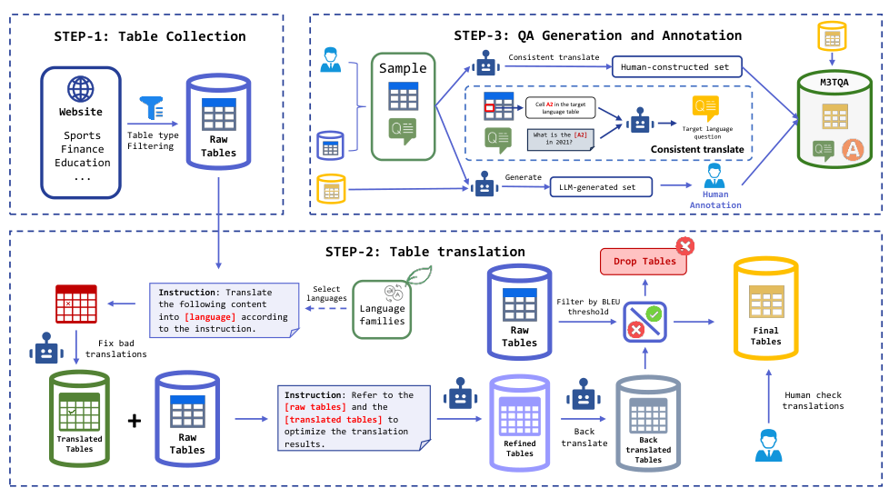

*原文 Fig. 2，PDF 第 3 页。97 语言表格翻译、验证与多任务数据构建流程（数据方法图）。*

**原文证据：**

- [Submission history](https://arxiv.org/abs/2508.16265)：首次公开 2025-08-22。
- [Sections 2.3, 3.1–3.3; Table 2; Figure 2](https://aclanthology.org/2026.findings-acl.1134.pdf)：正式版 39,982 个训练 QA / 6,606 个测试 QA，明确从 SFT checkpoint 做 GRPO。
- [Repository content](https://github.com/sdxvv/m3TQA)：作者仓库可访问，但核验时仅占位 README，未发布训练代码。

**阅读备注：**

- 采用正式 ACL 版本统计；不混用旧 arXiv 的 39,077/7,210 数字。
- 论文未提供独立 RL 流程图，所提取 Figure 2 为整体数据构建方法图；RL 方法见 Section 3.3。
- 官方仓库目前是占位页，应显示代码未完整发布。

## DocR1: Evidence Page-Guided GRPO for Multi-Page Document Understanding

**首次公开：** 2025-08-10 · **发表/版本：** AAAI 2026 · **类别：** multimodal · **任务：** TQA / TFV

[论文](https://ojs.aaai.org/index.php/AAAI/article/view/38097) · [核对 PDF](https://ojs.aaai.org/index.php/AAAI/article/download/38097/42059) · 代码链接：未核实

**日期说明：** 预印本首次提交：2025-08-10，https://arxiv.org/abs/2508.07313；图与方法采用 AAAI 2026 正式 PDF。

**RL 方法：** Evidence Page-Guided GRPO（EviGRPO）

用单页→多页课程训练 Qwen2.5-VL，先定位证据页再回答。GRPO 联合答案 ANLS、证据页 F1 与输出格式奖励，降低多页定位错误；两阶段均为 RL，教师标注过程不等于 SFT。

| 阶段 | 数据与用途 |
| --- | --- |
| SFT / 冷启动 | 未新增 SFT；直接从 Qwen2.5-VL-7B-Instruct 进入两阶段 EviGRPO。 |
| RL 训练 | EviBench 4,800：单页 1,300（13 来源各 100，含 WTQ 与 TabFact）；多页 3,500（DUDE 1,000，MP-DocVQA/TATDoc/SlideVQA/MultiHiertt/ArxivFullQA 各 500）。 |
| 评测 | WTQ、TabFact、DocVQA 等单页基准；MP-DocVQA、DUDE、SlideVQA、MultiChartQA、MultiHiertt、TATDoc、ArxivFullQA 等多页基准。 |

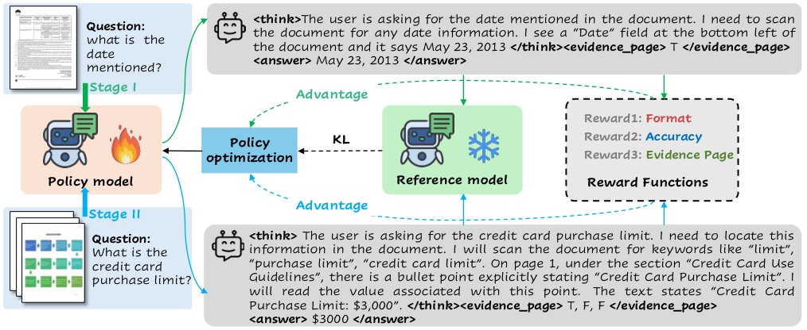

*原文 Fig. 2，PDF 第 3 页。单页到多页课程的 EviGRPO 训练框架。*

**原文证据：**

- [Data Construction / Curriculum Learning，PDF pp.3–5](https://ojs.aaai.org/index.php/AAAI/article/download/38097/42059)：EviBench 4,800，单页和多页来源与课程 RL 阶段。
- [Implementation Details，PDF p.5](https://ojs.aaai.org/index.php/AAAI/article/download/38097/42059)：无需额外 SFT；两阶段分别一轮 GRPO。
- [Table 1 / 单页实验，PDF pp.4–6](https://ojs.aaai.org/index.php/AAAI/article/download/38097/42059)：WTQ、TabFact 是训练来源和明确评测任务。
- [Fig.2，PDF p.3](https://ojs.aaai.org/index.php/AAAI/article/download/38097/42059)：原文 EviGRPO 框架。
- [论文元数据 / 版本记录](https://ojs.aaai.org/index.php/AAAI/article/view/38097)：标题、日期与公开版本来源；采用下述日期说明（如有）。

**阅读备注：**

- ArxivFullQA 8.6K 是完整论文 QA 评测规模，不能当成 RL 训练量；EviBench 仅使用其中 500 条训练样本。
- 多页金融来源按原文命名为 TATDoc，保留其原始称呼。

## OpenTable-R1: A Reinforcement Learning Augmented Tool Agent for Open-Domain Table Question Answering

**首次公开：** 2025-07-02 · **发表/版本：** arXiv · **类别：** text · **任务：** TQA

[论文](https://arxiv.org/abs/2507.03018) · [核对 PDF](https://arxiv.org/pdf/2507.03018v1) · [代码](https://github.com/TabibitoQZP/OpenTableR1)

**RL 方法：** Cold-start SFT + Async GRPO

训练 Qwen3-4B 在多轮对话中调用 BM25+ 表检索和 SQLite SQL 执行工具。先以简单问题的正确轨迹冷启动，再在困难问题上用 Async GRPO 优化策略；LoRA 与 rollout buffer 重叠采样和参数更新以缓解长轨迹带来的等待。

| 阶段 | 数据与用途 |
| --- | --- |
| SFT / 冷启动 | Open-WikiTable train 的 31,959 条简单样本；由 Qwen3-32B 生成答案并按答案 EM 筛选；full-parameter SFT 2 epochs。 |
| RL 训练 | Open-WikiTable train 的其余 21,860 条困难样本；Async GRPO + LoRA rank 12，1,504 update steps。 |
| 评测 | Open-WikiTable test 的 1,024 条随机子集（全量 test 6,602）。 |

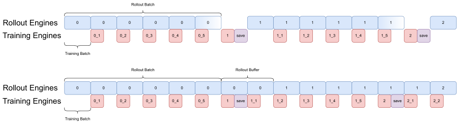

*原文 Fig. 1，PDF 第 4 页。Plain GRPO versus Async GRPO time series: rollout engines, training batches, and rollout buffer.*

**原文证据：**

- [Metadata and abstract](https://arxiv.org/abs/2507.03018)：First submitted 2 July 2025; links author code.
- [Section 2.2](https://arxiv.org/html/2507.03018v1#S2.SS2)：Clipped, importance-weighted GRPO objective, LoRA adapters and asynchronous rollout buffer.
- [Section 3.2, Table 4](https://arxiv.org/html/2507.03018v1#S3.SS2)：31,959 SFT and 21,860 RL training examples are separate Open-WikiTable subsets.
- [Figure 1, PDF page 4](https://arxiv.org/pdf/2507.03018v1)：Original Async GRPO diagram, the only numbered method figure.

**阅读备注：**

- 基准为 Open-WikiTable，不能混写成 WikiTableQuestions 或 OTT-QA。
- 论文提及 QA reward 与工具调用成本，但没有完整给出可复核的各奖励项公式/权重；不补造具体 reward 数值。
- 代码 README 的约 88% 与论文 86.2% 不一致；以论文测试子集结果为准。

## MTabVQA: Evaluating Multi-Tabular Reasoning of Language Models in Visual Space

**首次公开：** 2025-06-13 · **发表/版本：** Findings of EMNLP 2025 · **类别：** multimodal · **任务：** TQA

[论文](https://aclanthology.org/2025.findings-emnlp.1083/) · [核对 PDF](https://aclanthology.org/2025.findings-emnlp.1083.pdf) · [代码](https://github.com/anshulsc/MTabVQA-EMNLP)

**RL 方法：** GRPO experimental branch (EasyR1)

在多张表格图像之间执行多跳 QA；论文附加 GRPO 实验训练 Qwen2.5-VL-3B，复合奖励包含 EM/F1 答案正确性、think/answer 标签结构和 JSON 有效性，并与独立 SFT 分支比较。

| 阶段 | 数据与用途 |
| --- | --- |
| SFT / 冷启动 | 独立 SFT 比较分支：同一 2,395 条 Spider 来源子集；主 TableVision 模型另用完整 MTabVQA-Instruct 进行 SFT。 |
| RL 训练 | MTabVQA-Instruct 的 Spider 来源 2,395 QA 子集；Qwen2.5-VL-3B 用 EasyR1 训练 270 steps。 |
| 评测 | MTabVQA-Eval，3,745 QA；Spider、Query、ATIS、MiMo 子集。 |

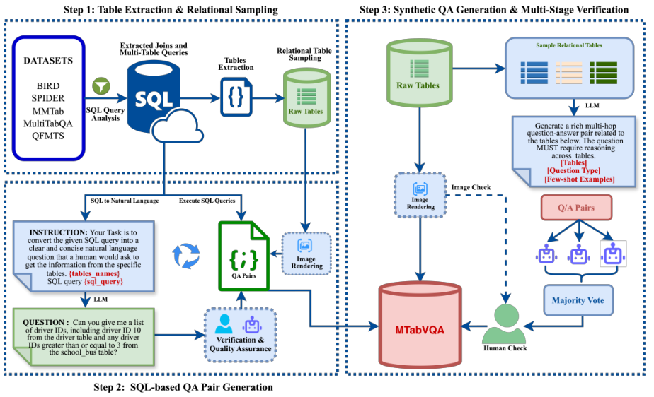

*原文 Fig. 2，PDF 第 5 页。Relational sampling, visual QA generation and dataset verification pipeline.*

**原文证据：**

- [Submission history](https://arxiv.org/abs/2506.11684)：First submitted 13 June 2025.
- [Section 4.2, pages 7–8; Appendix G, page 22](https://aclanthology.org/2025.findings-emnlp.1083.pdf)：Actual 2,395-sample GRPO experiment; accepted version specifies EM/F1, structural and JSON reward components.
- [Figure 2, page 5](https://aclanthology.org/2025.findings-emnlp.1083.pdf)：Original method diagram is dataset construction, not an RL architecture figure.
- [Repository README/about](https://github.com/anshulsc/MTabVQA-EMNLP)：Author repository for data generation and evaluation; standalone GRPO implementation availability not established.

**阅读备注：**

- 收录的是论文中的 GRPO 实验分支；主 TableVision 是 SFT，不能描述为 GRPO 训练模型。
- 论文未提供专门 RL 方法架构图，使用 Fig.2 数据构建流程图并明确标注。
- 该实验中 GRPO 优于 CoT，但低于相同数据的 SFT。

## Table-r1: Self-supervised and Reinforcement Learning for Program-based Table Reasoning in Small Language Models

**首次公开：** 2025-06-06 · **发表/版本：** arXiv · **类别：** text · **任务：** TQA / TFV

[论文](https://arxiv.org/abs/2506.06137) · [核对 PDF](https://arxiv.org/pdf/2506.06137v1) · [代码](https://github.com/AriKing11/Table_r1_public)

**RL 方法：** Mix-paradigm GRPO

先用自生成的布局变换推断任务学习表格结构，再蒸馏代码推理冷启动。混合范式 GRPO 优先学习可执行 Python，并允许在合适问题上回退为文本推理；格式、编译和答案奖励配合退化短代码惩罚。

| 阶段 | 数据与用途 |
| --- | --- |
| SFT / 冷启动 | 布局变换合成三元组；WikiTQ、TabFact、HiTab、AIT-QA 训练划分由 DeepSeek-v3 蒸馏，每数据集最多 5,000 条冷启动轨迹。 |
| RL 训练 | WikiTQ、TabFact、HiTab 的官方训练划分；AIT-QA 按问题随机 8:2 划分后的训练部分。 |
| 评测 | WikiTQ、TabFact、HiTab 官方测试划分，以及 AIT-QA 20% 测试部分。 |

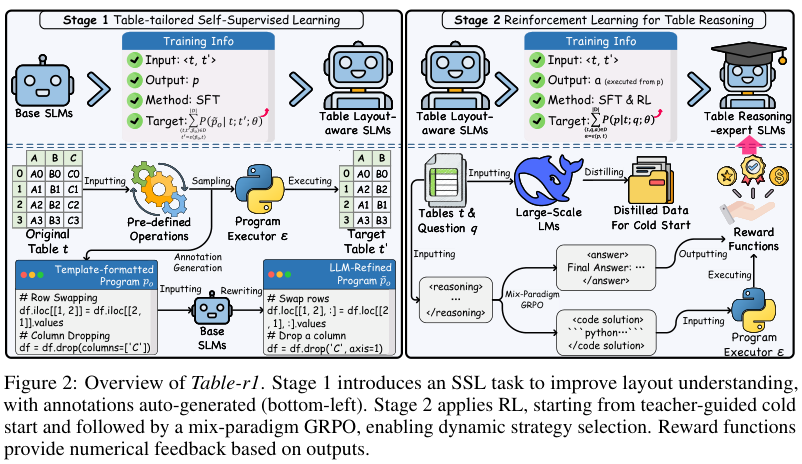

*原文 Fig. 2，PDF 第 4 页。布局变换自监督阶段与混合范式 GRPO 训练总览。*

**原文证据：**

- [Metadata and submission history](https://arxiv.org/abs/2506.06137)：首次公开 2025-06-06；与其他 Table-R1 同名工作不同。
- [Sections 4.1–4.2, 5.1; Appendix C; Figure 2](https://arxiv.org/pdf/2506.06137v1)：布局变换、冷启动、GRPO 与四个数据集划分。

**阅读备注：**

- 作者仓库可访问，但内容发布完整性需单独检查。
- 实现截取表格前十行；AIT-QA 为问题级随机划分。

## Multimodal Tabular Reasoning with Privileged Structured Information

**首次公开：** 2025-06-04 · **发表/版本：** NeurIPS 2025 · **类别：** multimodal · **任务：** TQA / TFV

[论文](https://arxiv.org/abs/2506.04088) · [核对 PDF](https://arxiv.org/pdf/2506.04088v1) · 代码链接：未核实

**RL 方法：** Structure-aware trace SFT + GRPO

TURBO 在训练期把 Markdown 表格作为特权信息，让 DeepSeek-R1 生成并筛选结构感知推理轨迹；先蒸馏到图像模型，再以答案正确性和输出格式奖励做 GRPO。推理期仅输入表格图像。

| 阶段 | 数据与用途 |
| --- | --- |
| SFT / 冷启动 | TabMWP、WTQ、TAT-QA、TabFact、InfoTabs 各采 2K，10K 经拒绝采样保留约 9K 高质量轨迹。 |
| RL 训练 | 同一约 9K 数据；各问题采 16 个回答，执行 GRPO。HiTab 因 Markdown 层级格式困难而未用于训练。 |
| 评测 | TabMWP、WTQ、HiTab、TAT-QA、TabFact、InfoTabs；MMMU 表格相关 165 题。 |

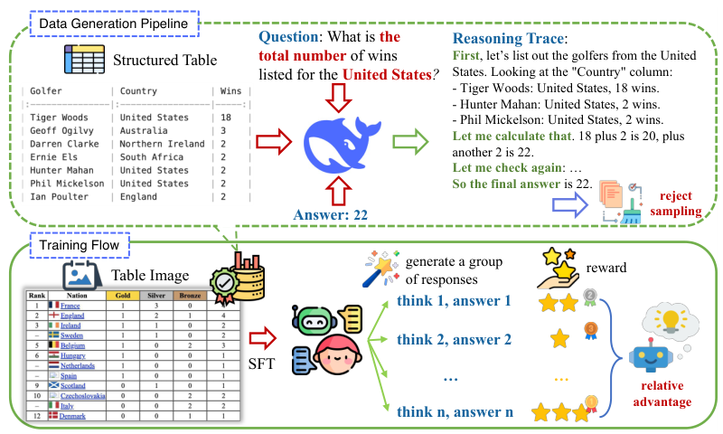

*原文 Fig. 3，PDF 第 5 页。Privileged-table trace generation followed by visual SFT and GRPO.*

**原文证据：**

- [Submission history](https://arxiv.org/abs/2506.04088)：First submitted 4 June 2025.
- [NeurIPS 2025 accepted paper](https://openreview.net/pdf?id=AuBSUgFVgq)：Accepted conference version establishes venue.
- [Appendix A.1–A.2; Section 4.2](https://arxiv.org/html/2506.04088v1#A1)：Five 2K source pools filtered to 9K, shared SFT/RL corpus, HiTab excluded from training.
- [Figure 3, page 5; reward paragraph page 7](https://arxiv.org/pdf/2506.04088v1)：Original framework diagram and format-plus-correctness GRPO reward.

**阅读备注：**

- HiTab 是评测集，不是训练集；FeTaQA 被作者排除。
- 未发现经作者确认的官方代码链接。

## Reasoning-Table: Exploring Reinforcement Learning for Table Reasoning

**首次公开：** 2025-06-02 · **发表/版本：** arXiv · **类别：** text · **任务：** TQA / TFV / T2T / Text-to-SQL

[论文](https://arxiv.org/abs/2506.01710) · [核对 PDF](https://arxiv.org/pdf/2506.01710v1) · [代码](https://github.com/MJinXiang/Reasoning-Table)

**核对版本：** arXiv v1

**RL 方法：** GRPO

比较 RL-zero 与 Reason-SFT+RL，用最终答案、SQL 执行或文本 BLEU 阈值构造结果奖励，并加入格式奖励。系统研究教师轨迹过滤、训练样本难度、单任务与合并训练；位置证据一致性奖励作为消融实验。

| 阶段 | 数据与用途 |
| --- | --- |
| SFT / 冷启动 | WikiTQ、HybridQA、MultiHiertt、OTT-QA、FinQA、FeTaQA、TAT-QA、HiTab、ToTTo、TabFact、FEVEROUS 的教师推理轨迹；Table 8 保留 97,564 条，统一 SFT 为 43,201 条；ToTTo 单任务 Reason-SFT 为 1,896 条。Spider/BIRD 另有 SQL 实验。 |
| RL 训练 | 单数据集 RL：上述 11 个表格语料训练划分，以及 Spider/BIRD；T2T 明确在 ToTTo 上做 RL-zero 与 Reason-SFT+RL。另报告合并 TQA 训练及难度控制；原文未给所有 RL 配置共用的单一样本总数。 |
| 评测 | 上述数据集的评测划分；AIT-QA、TableBench 为域外评测。 |

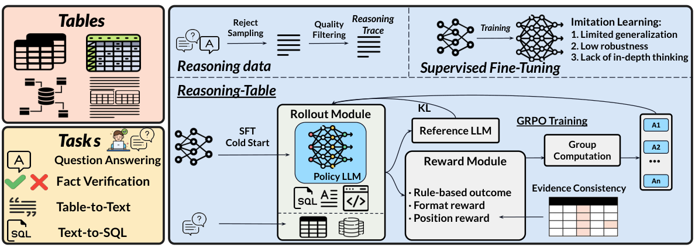

*原文 Fig. 1，PDF 第 2 页。多类表格推理任务上的 SFT 与 GRPO 比较框架。*

**原文证据：**

- [Submission history / Comments](https://arxiv.org/abs/2506.01710)：首次公开 2025-06-02；作者标为 Work in progress。
- [Sections 3.1–3.4, 4.1; Tables 1–2; Appendix A.2/Table 8; Figure 1](https://arxiv.org/pdf/2506.01710v1)：GRPO 实验及训练来源；Table 2 明确 ToTTo RL 结果，Table 8 区分单任务和统一 SFT。
- [Sections 5.1–5.2; Tables 3–4; Appendix B.3](https://arxiv.org/pdf/2506.01710v1)：位置奖励属于消融；AIT-QA/TableBench 为域外评测。
- [README / training scripts](https://github.com/MJinXiang/Reasoning-Table)：可访问的作者实现。

**阅读备注：**

- 15 个评测基准不等于同一个合并 RL 训练集。
- 统一 SFT 中 ToTTo 和 FEVEROUS 为 0；它们仍有单数据集 RL 实验。
- 默认主要配置位置奖励权重为 0，不能把位置一致性写成所有主实验都使用。

## Table-R1: Inference-Time Scaling for Table Reasoning Tasks

**首次公开：** 2025-05-29 · **发表/版本：** EMNLP 2025 · **类别：** text · **任务：** TQA / TFV / T2T

[论文](https://aclanthology.org/2025.emnlp-main.1040/) · [核对 PDF](https://aclanthology.org/2025.emnlp-main.1040.pdf) · [代码](https://github.com/Table-R1/Table-R1)

**旧标题/别名：** Table-R1: Inference-Time Scaling for Table Reasoning

**核对版本：** EMNLP 2025 published version, 20 pages

**RL 方法：** GRPO with DAPO token-level loss and asymmetric clipping; no KL penalty

Table-R1-Zero 直接从指令模型做 RL：采用 DAPO 的 token 级损失与非对称裁剪，不加 KL 惩罚。短答案与事实验证用正确性奖励，长答案用 BLEU/ROUGE-L，另加结构化输出奖励；多次采样扩展推理时计算。

| 阶段 | 数据与用途 |
| --- | --- |
| SFT / 冷启动 | 独立 Table-R1-SFT 对照：WTQ、HiTab、TabFact、FeTaQA 经 DeepSeek-R1 生成并验证的 33,601 条长思维链；不是 Table-R1-Zero 的冷启动阶段。 |
| RL 训练 | 四个训练划分过滤后共 48,563 条：WTQ 13,706；HiTab 6,793；TabFact 20,740；FeTaQA 7,324。 |
| 评测 | 域内：WTQ、HiTab、TabFact、FeTaQA；域外：ToTTo、QTSumm、RotoWire、InfoTabs、PubHealthTab、FEVEROUS、TabMCQ、TabMWP、FinQA。 |

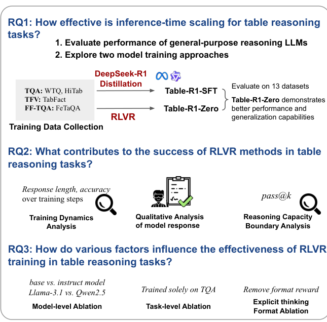

*原文 Fig. 2，PDF 第 2 页。独立 SFT 与 RLVR 两条训练路线及推理时扩展。*

**原文证据：**

- [Submission history](https://arxiv.org/abs/2505.23621)：首次公开 2025-05-29。
- [Publication metadata](https://aclanthology.org/2025.emnlp-main.1040/)：EMNLP 2025 正式标题带 Tasks。
- [Sections 3.1–3.3, 4.1–4.2; Table 1; Figure 2](https://aclanthology.org/2025.emnlp-main.1040.pdf)：训练集样本数、GRPO/DAPO 目标与各任务奖励；SFT/RL 两种独立模型。
- [README / training scripts](https://github.com/Table-R1/Table-R1)：官方仓库分别提供 SFT 与 RL 训练入口。

**阅读备注：**

- T2T 为 ToTTo/QTSumm/RotoWire 域外生成评测；RL 训练来源是四个 TQA/TFV 数据集。
- 论文训练样本数与后续 Hugging Face 发布集合大小可能不同，采用固定版本论文的数字。
- ACL 元数据标题带 Tasks，而正式 PDF 标题不带；本条按元数据引用并保留 PDF 标题为别名。

## Formula-R1: Incentivizing LLM Reasoning over Complex Tables with Numerical Computation via Formula-Driven Reinforcement Learning

**首次公开：** 2025-05-29 · **发表/版本：** arXiv · **类别：** text · **任务：** TQA / TFV

[论文](https://arxiv.org/abs/2505.23667) · [核对 PDF](https://arxiv.org/pdf/2505.23667v3) · [代码](https://github.com/microsoft/Fortune)

**旧标题/别名：** Fortune: Formula-Driven Reinforcement Learning for Symbolic Table Reasoning in Language Models

**核对版本：** arXiv v3, 2026-03-23

**RL 方法：** PPO

Formula Tuning 让模型先思考再生成可执行表格公式，借助公式引擎提供可验证奖励：答对 1、可执行但错误 0.2、不可执行 0，另加格式奖励。比较直接 PPO 与蒸馏冷启动；Plus 在推理时融合文本和公式答案投票。

| 阶段 | 数据与用途 |
| --- | --- |
| SFT / 冷启动 | 五个源训练集上由 GPT-4o 生成思维链/公式，经答案或公式执行正确性拒绝筛选的冷启动数据；SFT+RL 配置使用，RL-zero 不使用。 |
| RL 训练 | 合并 WikiTQ 13,753、TabFact 10,000（随机下采样）、FinQA 6,251、HiTab 7,399、MultiHiertt 7,795 条训练数据。 |
| 评测 | 上述五个数据集测试划分；AIT-QA、TableBench 为域外评测。 |

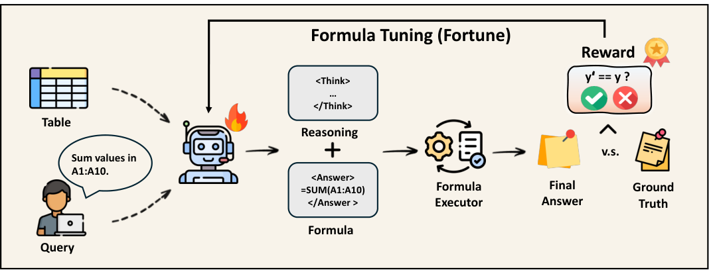

*原文 Fig. 1，PDF 第 4 页。思维链、公式生成/执行与公式驱动 RL 的总览。*

**原文证据：**

- [Submission history / current title](https://arxiv.org/abs/2505.23667)：首次公开 2025-05-29；旧标题 Fortune，v3 更名 Formula-R1。
- [Section 3.2; Appendix E, pp.25–26/Table 4; Figure 1](https://arxiv.org/pdf/2505.23667v3)：奖励三档、五数据集联合训练、实际采用 PPO（非 GRPO）及 GPT-4o SFT 筛选。
- [README](https://github.com/microsoft/Fortune)：作者公开的 Fortune/Formula Tuning 核心实现。

**阅读备注：**

- 固定最新版本与更名信息，Fortune 不另列为重复论文。
- 仓库提供核心组件，完整训练需按其说明整合 verl。
- 论文报告按测试集 EM 选择 SFT checkpoint，应在解释实验结果时注意此设置。

## Mixture-of-Retrieval Experts for Reasoning-Guided Multimodal Knowledge Exploitation

**首次公开：** 2025-05-28 · **发表/版本：** SIGIR 2026 (arXiv v2 2026-04-06) · **类别：** text · **任务：** TQA / TFV

[论文](https://arxiv.org/abs/2505.22095) · [核对 PDF](https://arxiv.org/pdf/2505.22095v2) · [代码](https://github.com/OpenBMB/MoRE)

**RL 方法：** Step-GRPO

通用检索代理 MoRE 在文本、图像、结构化表格专家之间逐步路由。先生成并筛选教师轨迹，再按步骤采样，用查询与教师查询的 BGE-M3 相似度、专家选择正确性、观察/答案质量和格式奖励做 Step-GRPO；明确包含表格 QA 的 RL 训练。

| 阶段 | 数据与用途 |
| --- | --- |
| SFT / 冷启动 | 主方法未报告独立 SFT 热启动；代码直接从 Qwen2.5-VL-Instruct 开始 Step-GRPO。教师轨迹来自相同训练集（Qwen2.5-VL-7B 生成 VQA，R1-Distill-Qwen-32B 生成 Text/Table QA）；SFT 是对照方法。 |
| RL 训练 | Open-WikiTable 500 条（表格 QA）；另含 2WikiMultihopQA 500 条、InfoSeek 1,000 条，总计 2,000 条源问题。步骤级展开后的训练记录数未明确报告。 |
| 评测 | Open-WikiTable 1,000；TabFact 1,000（OOD TFV）；另有 2WikiMultihopQA 1,000、InfoSeek 1,000、Dyn-VQA 715、WebQA 1,000。 |

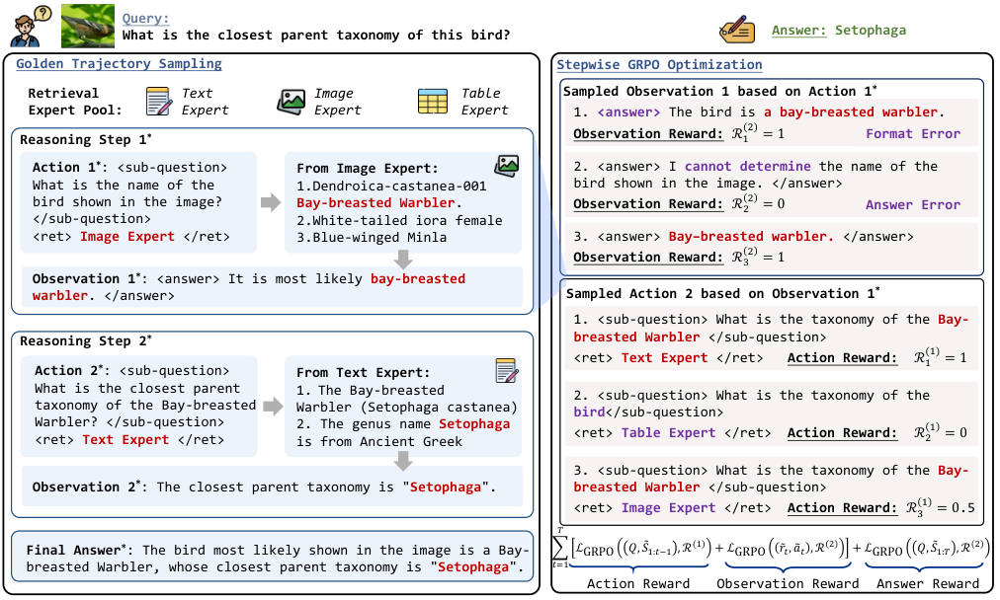

*原文 Fig. 2，PDF 第 4 页。The Architecture of Stepwise GRPO Training Used by MoRE.*

**原文证据：**

- [Submission history](https://arxiv.org/abs/2505.22095)：First submitted 28 May 2025; v2 6 April 2026 uses MoRE title. v1 was Learning to Route Queries Across Knowledge Bases for Step-wise Retrieval-Augmented Reasoning / R1-Router.
- [Section 3.3 Eqs. 9–14; Section 4 Table 1](https://arxiv.org/html/2505.22095v2)：Actual stepwise GRPO loss and reward definitions; Open-WikiTable is explicitly part of training, TabFact only OOD evaluation.
- [README News 2026.04.03; Training](https://github.com/OpenBMB/MoRE)：Author repository confirms SIGIR 2026 acceptance and actual Step-GRPO training implementation.
- [get_llm_response lines 89–100; origin_question_gen lines 105–128](https://github.com/OpenBMB/MoRE/blob/main/src/answer_generation.py)：VQA takes actual image pixels; OpenWikiTQA and TabFact are text-question branches without image input.
- [lines 136–143 and 161–177](https://github.com/OpenBMB/MoRE/blob/main/Easy-R1/verl/utils/rl_dataset.py)：Training image examples use real image processing; text/table examples use a dummy white image for VLM batching, not a table screenshot.
- [MODEL_PATH](https://github.com/OpenBMB/MoRE/blob/main/Easy-R1/examples/run_qwen2_5_vl_7b_stepgrpo.sh)：Step-GRPO starts Qwen/Qwen2.5-VL-7B-Instruct; no separate SFT checkpoint specified.
- [Figure 2 PDF page 4](https://arxiv.org/pdf/2505.22095v2)：Original Step-GRPO method diagram.

**阅读备注：**

- 这是通用多模态检索代理，因实际训练含表格 QA 而收录；不是表格专用方法。
- 按表格任务实际输入归入文本表格：Open-WikiTable/TabFact 的表格为结构化文本，并非表格图像；VQA 分支确实处理图片像素。
- TabFact 是 OOD 测试集，不是 RL 或 SFT 训练集。
- 论文初稿名 R1-Router；2026 年 v2 更名为 MoRE，视为同一篇文章，不能重复计数。

## Table-R1: Region-based Reinforcement Learning for Table Understanding

**首次公开：** 2025-05-18 · **发表/版本：** arXiv · **类别：** text · **任务：** TQA / TFV / Data Analysis

[论文](https://arxiv.org/abs/2505.12415) · [核对 PDF](https://arxiv.org/pdf/2505.12415v3) · [代码](https://github.com/wuzhenhe/Table-R1)

**核对版本：** arXiv v3, 2026-05-13

**RL 方法：** TARPO (Table-Aware Group Relative Policy Optimization)

RE-SFT 先学习在推理步骤中定位最小相关行列区域；再用 TARPO 将行列 IoU 与最终答案正确性组合为奖励，逐步衰减区域奖励，并惩罚区域与答案优势方向不一致的更新。支持直接、文本思维链、符号和程序推理。

| 阶段 | 数据与用途 |
| --- | --- |
| SFT / 冷启动 | TableInstruct-RE：在 TableInstruct 的 19,661 条指令上由 DeepSeek-R1 生成最小相关区域并人工核对；RE-SFT 使用全量。 |
| RL 训练 | 同一 TableInstruct-RE，随机按 9:1 划分 TARPO 训练/验证；不把 TableBench、WikiTQ 或 WikiSQL 测试集列作训练数据。 |
| 评测 | TableBench、WikiTQ 测试集、WikiSQL 测试集。 |

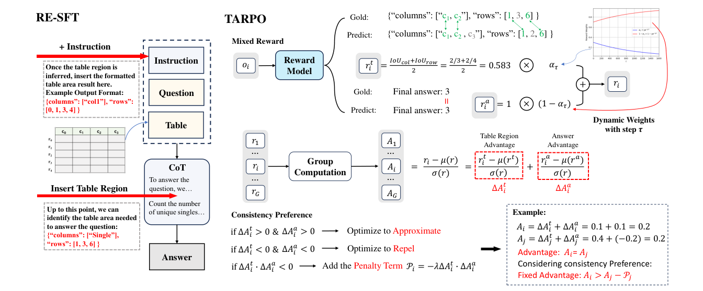

*原文 Fig. 2，PDF 第 3 页。RE-SFT 区域标注与 TARPO 区域/答案奖励训练流程。*

**原文证据：**

- [Submission history](https://arxiv.org/abs/2505.12415)：首次公开 2025-05-18；固定 v3。
- [Sections 2.3–2.4; Implementation Details, PDF p.5; Figure 2](https://arxiv.org/pdf/2505.12415v3)：TARPO 实际策略更新、区域 IoU/答案奖励；RE-SFT 全量，RL 9:1 划分。
- [README and RE-SFT/TARPO directories](https://github.com/wuzhenhe/Table-R1)：作者公开实现与 TableInstruct 区域数据。

**阅读备注：**

- 与其他同名 Table-R1 工作是不同论文，不合并条目。

## Sparks of Tabular Reasoning via Text2SQL Reinforcement Learning

**首次公开：** 2025-04-23 · **发表/版本：** TRL Workshop 2025 (ACL) · **类别：** text · **任务：** TQA / TFV / Text-to-SQL

[论文](https://aclanthology.org/2025.trl-1.20/) · [核对 PDF](https://aclanthology.org/2025.trl-1.20.pdf) · [代码](https://github.com/josefastoisser/sparks_of_tabular_reasoning)

**核对版本：** ACL TRL Workshop published version, 12 pages

**RL 方法：** GRPO

先用 o3-mini 生成 SQL 与逐步推理，由第二模型检查答案和轨迹，再做 SFT；随后在 BIRD 上做 GRPO，用 SQL 质量、匹配与 LLM 评分奖励。检验仅 SQL 训练是否迁移到 CRT-QA 和表格事实验证。

| 阶段 | 数据与用途 |
| --- | --- |
| SFT / 冷启动 | Clinton/Text-to-SQL 集合生成并验证的 3,174 条 SQL/CoT 轨迹（正式版本数字）。 |
| RL 训练 | BIRD；正式论文 Figure 2、Table 1 和实现说明明确用于 GRPO，但未明确给出 RL 子集的准确条数与划分。 |
| 评测 | Clinton、BIRD minidev；CRT-QA、TableBench Fact Checking 为表格理解迁移评测。 |

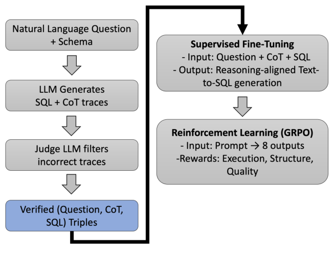

*原文 Fig. 2，PDF 第 4 页。SQL/CoT 合成与验证、Clinton SFT、BIRD GRPO 两阶段流程。*

**原文证据：**

- [Submission history](https://arxiv.org/abs/2505.00016)：首次公开是 2025-04-23，不按 arXiv 编号推断月份。
- [Sections 3.1–3.2, 4.1; Figure 2; Table 1; Appendix C](https://aclanthology.org/2025.trl-1.20.pdf)：3,174 个 SFT 轨迹、BIRD GRPO；CRT-QA/事实验证为迁移评测。
- [README / training documentation](https://github.com/josefastoisser/sparks_of_tabular_reasoning)：作者公开训练、评测说明和合成数据。

**阅读备注：**

- 标为 SQL 训练向表格理解迁移，不扩展为收集纯 Text-to-SQL 工作。
- 主文所谓 execution-based 奖励含 o3-mini 估计 SQL 字符修改数；Appendix C 又描述 SQLite execution-guided 奖励，不能把所有奖励都写成数据库真实执行。
- 不把 BIRD minidev 评测划分自行认定为 RL 训练划分。

## DianJin-R1: Evaluating and Enhancing Financial Reasoning in Large Language Models

**首次公开：** 2025-04-22 · **发表/版本：** arXiv · **类别：** text · **任务：** TQA

[论文](https://arxiv.org/abs/2504.15716) · [核对 PDF](https://arxiv.org/pdf/2504.15716v1) · [代码](https://github.com/aliyun/qwen-dianjin)

**核对版本：** arXiv v1

**RL 方法：** SFT + GRPO

先以金融 CoT 数据做 SFT，再对困难金融选择题做 GRPO，以答案选项匹配和 think/answer 格式提供奖励；在 FinQA 上检验后训练模型的表格数值推理能力。

| 阶段 | 数据与用途 |
| --- | --- |
| SFT / 冷启动 | CFLUE-MCQ 26,672、CFLUE-OE 5,045、FinQA 4,851、Chinese Compliance Check 1,800。 |
| RL 训练 | CFLUE-MCQ 的 4,096 道困难选择题；当前版本未将 FinQA 用于 RL。 |
| 评测 | CFLUE、FinQA、Chinese Compliance Check；MATH-500、GPQA Diamond 域外评测。 |

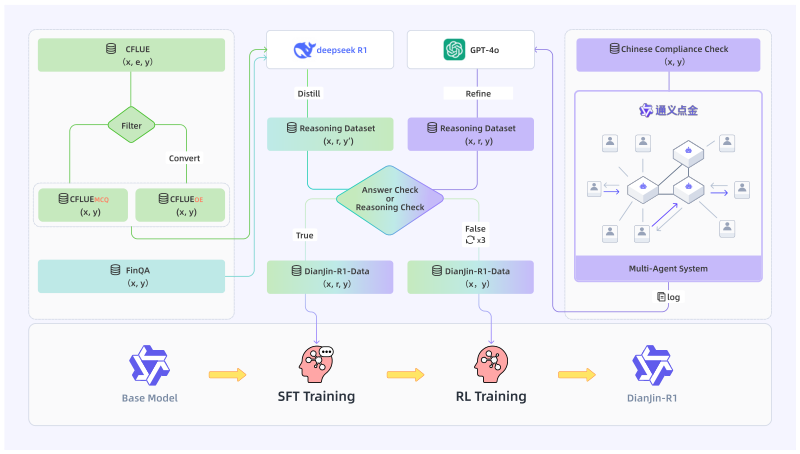

*原文 Fig. 2，PDF 第 6 页。DianJin-R1 的 SFT→RL 两步训练。*

**原文证据：**

- [Table 1，PDF p.5](https://arxiv.org/pdf/2504.15716v1)：FinQA 4,851 用于 SFT；RL 栏仅有 CFLUE-MCQ 4,096。
- [§3.1 / 脚注 2，PDF p.6](https://arxiv.org/pdf/2504.15716v1)：当前准确性奖励仅用于 CFLUE 多选题；FinQA/OE/CCC 纳入 RL 属于未来计划。
- [Fig.2，PDF p.6](https://arxiv.org/pdf/2504.15716v1)：原文两步后训练示意。
- [论文元数据 / 版本记录](https://arxiv.org/abs/2504.15716)：标题、日期与公开版本来源；采用下述日期说明（如有）。

**阅读备注：**

- 属于跨任务迁移边界条目，收录依据是实际 GRPO 后训练模型的 FinQA 实验。

## Fin-R1: A Large Language Model for Financial Reasoning through Reinforcement Learning

**首次公开：** 2025-03-20 · **发表/版本：** arXiv · **类别：** text · **任务：** TQA

[论文](https://arxiv.org/abs/2503.16252) · [核对 PDF](https://arxiv.org/pdf/2503.16252v5) · [代码](https://github.com/SUFE-AIFLM-Lab/Fin-R1)

**核对版本：** arXiv v5，2026-03-19

**RL 方法：** SFT + GRPO

以 DeepSeek-R1 蒸馏的金融推理轨迹做 SFT，再用答案准确性与输出格式奖励进行 GRPO。RL 使用题目和客观答案，不依赖完整教师推理轨迹，并保留部分 SFT 阶段过滤掉的困难题。

| 阶段 | 数据与用途 |
| --- | --- |
| SFT / 冷启动 | Fin-R1-Data：60,091 条中英金融推理样本；包含 FinQA 2,948、ConvFinQA 7,629，以及 FinanceQT、Finance500K、FinanceIQ、FinPEE、AntFinance、FinCorpus、TFNS、FinCUGE。 |
| RL 训练 | 从上述原始来源整理客观题 (question, solution)，包含部分蒸馏未通过筛选的困难样本；未单列 RL 总量及各来源数量。60,091 是 SFT 数据规模。 |
| 评测 | FinQA、ConvFinQA、AntFinance、TFNS、Finance500K。 |

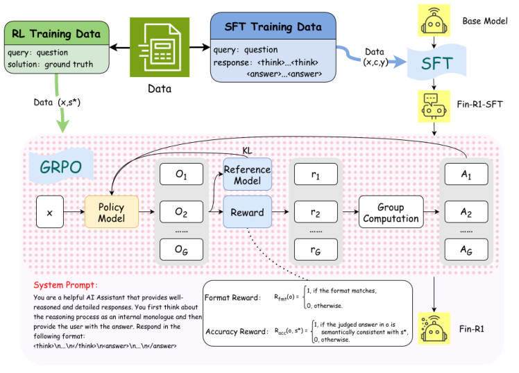

*原文 Fig. 5，PDF 第 16 页。金融模型的 SFT 与 GRPO 后训练框架。*

**原文证据：**

- [§3.1 / Appendix A Tables 3–4，PDF pp.11、39](https://arxiv.org/pdf/2503.16252v5)：Fin-R1-Data 规模与分来源统计；FinQA 和 ConvFinQA 属于表格金融问答。
- [§4.2，PDF p.19](https://arxiv.org/pdf/2503.16252v5)：GRPO 的 RL 数据与蒸馏 SFT 数据不同；困难题保留，未给 RL 样本总量。
- [Fig.5，PDF p.16](https://arxiv.org/pdf/2503.16252v5)：原文后训练方法图。
- [论文元数据 / 版本记录](https://arxiv.org/abs/2503.16252)：标题、日期与公开版本来源；采用下述日期说明（如有）。

## Question Answering with Texts and Tables through Deep Reinforcement Learning

**首次公开：** 2024-07-05 · **发表/版本：** BRACIS 2024 · **类别：** text · **任务：** TQA

[论文](https://arxiv.org/abs/2407.04858) · [核对 PDF](https://arxiv.org/pdf/2407.04858) · [代码](https://github.com/MMenonJ/DRL_QA_TT)

**RL 方法：** DQN / PPO (module-selection policy)

用 DRL 控制器在检索文本、检索表格、调用阅读器作答三种动作间决策，底层检索器和阅读器保持预训练权重。DQN/PPO 根据最终答案 EM/F1 获得延迟奖励，并对每次检索施加小额成本，学习开放域多跳证据获取顺序。

| 阶段 | 数据与用途 |
| --- | --- |
| SFT / 冷启动 | 控制器未使用动作序列 SFT；使用已有 BM25/Tri-encoder 检索器、FiE 阅读器和编码器，不重新训练这些底层模型。 |
| RL 训练 | OTT-QA train：41,469 个问题；Tri-encoder 方案 1M timesteps，BM25 方案 100K timesteps。 |
| 评测 | OTT-QA validation/dev（公开代码 test_models 脚本）；EM 与 F1。 |

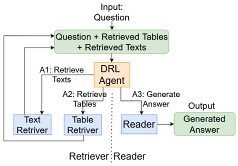

*原文 Fig. 2，PDF 第 7 页。Proposed architecture: the DRL agent selects Retrieve Texts, Retrieve Tables, or Generate the Answer based on current evidence.*

**原文证据：**

- [Submission history](https://arxiv.org/abs/2407.04858)：First submitted 5 July 2024.
- [Sections 3.2–3.3, PDF pages 8–9](https://arxiv.org/pdf/2407.04858)：Final reward is 2 for EM, F1 for partial overlap, -0.5 for no overlap; each retrieval costs -0.02; bottom modules are not retrained.
- [Section 4.2, PDF pages 10–11](https://arxiv.org/pdf/2407.04858)：OTT-QA training count and actual DQN/PPO optimization.
- [README Dataset, Training, Testing](https://github.com/MMenonJ/DRL_QA_TT)：Code is public; testing runs on validation dataset; DOI links BRACIS proceedings.
- [Figure 2, PDF page 7](https://arxiv.org/pdf/2407.04858)：Original architecture diagram.

**阅读备注：**

- RL 训练的是模块调度策略，不是对底层 LLM 做 RL 后训练；与 GRPO 论文应区分。
- 文本和表格联合输入不等于视觉多模态；归入文本表格理解。
- 该论文结果为探索性模块调度实验，不能描述为超越同期强基线。
